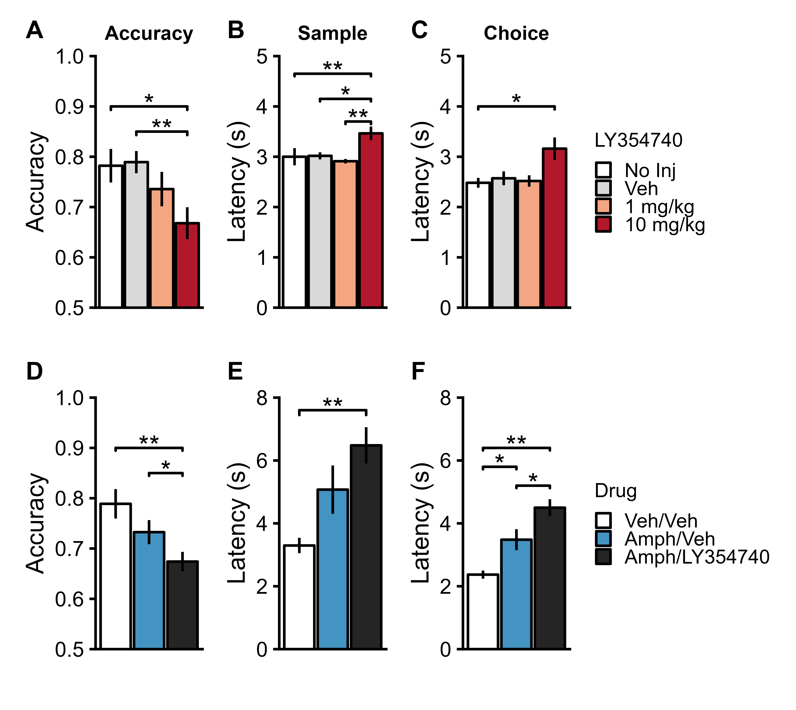
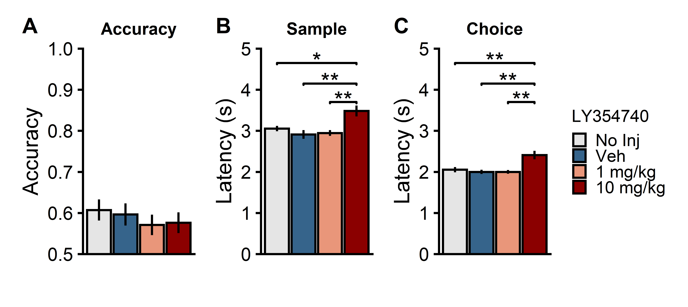

```{r setup, include=FALSE, message = FALSE, warning=FALSE}
knitr::opts_chunk$set(echo = FALSE)
## Packages for data organisation and plotting
library(tidyverse)
# Package for relative file paths
library(here)
# library(ggpubr)
library(cowplot)
library(ggsignif)
library(patchwork)
################################################################################
## Packages for Data analysis
library(afex)
afex_options(emmeans_model = "multivariate")# use multivariate model for all follow-up tests.
library(emmeans)
# install.packages("devtools")
# devtools::install_github("crsh/papaja")
library(papaja)
library(knitr)
```

# Results

## Experiment 1: LY354740 impaired spatial working memory in rats

```{r Expt. 1 LY354740 impairs spatial working memory, include=FALSE, message = FALSE, warning=FALSE}

#Load Data
full_data <- read_csv(here("rawdata", "/LY354740_TMaze_Expt1_rawdata.csv")) 
# Delay 0s data only
short_data <- full_data %>% 
  filter(Delay == "0")


# Stats - Accuracy
anova <- aov_4(Accuracy ~ (Drug|Subj), data = short_data, anova_table = list(correction = "none", es = "pes"))
anova_print <- apa_print(anova, mse = "FALSE",correction = "none",es = "pes")

simpledrug <- emmeans(anova, ~Drug)
simpledrug_print <- apa_print.emmGrid(contrast(simpledrug, method = "pairwise", simple = "Drug", adjust = "tukey"))

# Stats - Latency Sample
anova_latencySample <- aov_4(Latency_Sample ~ (Drug|Subj), data = short_data, anova_table = list(correction = "none", es = "pes"))
anova_latencySample_print <- apa_print(anova_latencySample, mse = "FALSE",correction = "none",es = "pes")

simpledrug_latencySample <- emmeans(anova_latencySample, ~Drug)
simpledrug_latencySample_print <- apa_print.emmGrid(contrast(simpledrug_latencySample, method = "pairwise", simple = "Drug", adjust = "tukey"))

# Stats - Latency Choice
# Stats - Latency Choice
anova_latencyChoice <- aov_4(Latency_Choice ~ (Drug|Subj), data = short_data, anova_table = list(correction = "none", es = "pes"))
anova_latencyChoice_print <- apa_print(anova_latencyChoice, mse = "FALSE",correction = "none",es = "pes")

simpledrug_latencyChoice <- emmeans(anova_latencyChoice, ~Drug)
simpledrug_latencyChoice_print <- apa_print.emmGrid(contrast(simpledrug_latencyChoice, method = "pairwise", simple = "Drug", adjust = "tukey"))

# anova_print$table
# simpledrug_print$table
# 
# anova_latencySample_print$table
# simpledrug_latencySample_print$table
# 
# anova_latencyChoice_print$table
# simpledrug_latencyChoice_print$table

```

We first established an active dose of the group II metabotropic agonist in our testing environment. Rats were injected with LY354740 intraperitoneally (i.p.) at a dose of either 1 mg/kg or 10 mg/kg, 45-50 min before behavioural testing. Two control conditions consisted of a no injection (No Inj) control and a distilled water (Veh) injected condition (1 ml/kg). Rewarded alternation a T-maze was used to assess spatial working memory, and was conducted as a within-subject design.

In agreement with previous reports [REF], an i.p. dose of 10 mg/kg LY354740 decreased spatial working memory performance (Fig. 1A-C; main effect of Drug on Accuracy `r anova_print$statistic$Drug`, Sample Latency `r anova_latencySample_print$statistic$Drug`, Choice Latency `r anova_latencyChoice_print$statistic$Drug`). This dose significantly reduced accuracy (Fig. 1A; No Inj vs 10 mg/kg `r simpledrug_print$statistic$NoInj_X10mgkg`, Veh vs 10 mg/kg `r simpledrug_print$statistic$Veh_X10mgkg`), and an increased latencies during the sample (Fig. 1B; No Inj vs 10 mg/kg `r simpledrug_latencySample_print$statistic$NoInj_X10mgkg`, Veh vs 10 mg/kg `r simpledrug_latencySample_print$statistic$Veh_X10mgkg`, 1 vs 10 mg/kg `r simpledrug_latencySample_print$statistic$x1mgkg_X10mgkg`) and choice phases (Fig. 1C; No Inj vs 10 mg/kg `r simpledrug_latencyChoice_print$statistic$NoInj_X10mgkg`).

## Experiment 2: LY354740 enhanced the effects of amphetamine on spatial working memory

```{r Expt. 2 LY354740 exacerbates amphetamine induced deficits in spatial working memory, include=FALSE, message = FALSE, warning=FALSE}

short_data <- read_csv(here("rawdata", "/LY354740_Amph_TMaze_Expt2_rawdata.csv")) 


# Stats - Accuracy
anova <- aov_4(Accuracy ~ (Drug|Subj), data = short_data, anova_table = list(correction = "none", es = "pes"))
anova_print <- apa_print(anova, mse = "FALSE",correction = "none",es = "pes")

simpledrug <- emmeans(anova, ~Drug)
simpledrug_print <- apa_print.emmGrid(contrast(simpledrug, method = "pairwise", simple = "Drug", adjust = "tukey"))

# Stats - Latency Sample
anova_latencySample <- aov_4(Latency_Sample ~ (Drug|Subj), data = short_data, anova_table = list(correction = "none", es = "pes"))
anova_latencySample_print <- apa_print(anova_latencySample, mse = "FALSE",correction = "none",es = "pes")

simpledrug_latencySample <- emmeans(anova_latencySample, ~Drug)
simpledrug_latencySample_print <- apa_print.emmGrid(contrast(simpledrug_latencySample, method = "pairwise", simple = "Drug", adjust = "tukey"))

# Stats - Latency Choice
# Stats - Latency Choice
anova_latencyChoice <- aov_4(Latency_Choice ~ (Drug|Subj), data = short_data, anova_table = list(correction = "none", es = "pes"))
anova_latencyChoice_print <- apa_print(anova_latencyChoice, mse = "FALSE",correction = "none",es = "pes")

simpledrug_latencyChoice <- emmeans(anova_latencyChoice, ~Drug)
simpledrug_latencyChoice_print <- apa_print.emmGrid(contrast(simpledrug_latencyChoice, method = "pairwise", simple = "Drug", adjust = "tukey"))

#Accuracy
anova_print$table
simpledrug_print$table
#Sample - Latency
anova_latencySample_print$table
simpledrug_latencySample_print$table
#Choice - Latency
anova_latencyChoice_print$table
simpledrug_latencyChoice_print$table

```

Having established an active dose of LY354740, we next investigated whether the metabotropic agonist could rescue spatial working memory deficits induced by amphetamine [REF]. The same cohort of rats tested on the T-maze in experiment 1 was used in this rewarded alternation experiment with amphetamine. Rats received two consecutive i.p. injections 45-50 min before behavioural testing. They received either Veh/Veh, Amph (2.5 mg/kg)/Veh, or Amph (2.5mg/kg)/LY354740 (10 mg/kg) in a within-subjects design. *One rat had to be excluded because it failed to run on the maze in the LY354740/AMPH condition.*

Overall, drug injections significantly disrupted all three performance measures on the spatial working memory task (Fig. 1D-F; main effect of Drug on Accuracy `r anova_print$statistic$Drug`, Sample Latency `r anova_latencySample_print$statistic$Drug`, Choice Latency `r anova_latencyChoice_print$statistic$Drug`). Compared to vehicle injections, amphetamine disrupted performance on the spatial working memory task, surprisingly given previous findings [REF] (Aultman and Moghaddam, 2001) this effect was only statistically robust for response latencies during the choice period (Veh/Veh vs Amph/veh: Accuracy `r simpledrug_print$statistic$Veh_Veh_Amph_Veh`), Sample Latency `r simpledrug_latencySample_print$statistic$Veh_Veh_Amph_Veh`, Choice Latency `r simpledrug_latencyChoice_print$statistic$Veh_Veh_Amph_Veh`). This deficit, at least in part, reflected an increase in undirected exploratory behaviours (e.g. sniffing and rearing) in the start arm, at the expense of performing the appetitively motivated memory task. However, rather than ameliorating these effects of amphetamine as might have been expected based on previous studies [REF], combining LY354740 and amphetamine significantly impaired accuracy (Fig. 1D; Veh/Veh vs Amph/LY354740 `r simpledrug_print$statistic$Veh_Veh_Amph_LY`, Amph/Veh vs Amph/LY354740 `r simpledrug_print$statistic$Amph_Veh_Amph_LY`), and increased response latencies during both the sample (Fig. 1E; Veh/Veh vs Amph/LY354740 `r simpledrug_latencySample_print$statistic$Veh_Veh_Amph_LY`, Amph/Veh vs Amph/LY354740 `r simpledrug_latencySample_print$statistic$Amph_Veh_Amph_LY`) and choice periods (Fig. 1F;Veh/Veh vs Amph/LY354740 `r simpledrug_latencyChoice_print$statistic$Veh_Veh_Amph_LY`, Amph/Veh vs Amph/LY354740 `r simpledrug_latencyChoice_print$statistic$Amph_Veh_Amph_LY`). Thus, rather than ameliorating the effects of amphetamine as predicted, LY354740 actually potentiated the effects of the dopaminergic psychomimetic during testing on the T-maze.

```{r Expt. 1/2  Plots - Fig. 1,  results='hide', include=FALSE, message = FALSE, warning=FALSE}
# Run script to generate figure
# Script run separately to minimize clutter
source(here("scripts","figures", "Fig1.R"))

```




## Experiment 3: LY354740 enhanced amphetamine-induced hyperlocomotion in food restricted rats


## Experiment 4: LY354740 reduced amphetamine-induced hyperlocomotion in ad libitum fed rats

## Experiment 5: LY354740 increased phasic dopamine responses in the nucleus accumbens to reward

## Experiment 5: LY354740 did not affect phasic dopamine responses in the nucleus accumbens in anaesthetised rats


## Supplementary results
### Experiment 1 - 40s delay


```{r Expt. 1 LY354740 40s Delay, include=FALSE, message = FALSE, warning=FALSE}

#Load Data
full_data <- read_csv(here("rawdata", "/LY354740_TMaze_Expt1_rawdata.csv")) 
# Delay 0s data only
short_data <- full_data %>% 
  filter(Delay == "40")


# Stats - Accuracy
anova <- aov_4(Accuracy ~ (Drug|Subj), data = short_data, anova_table = list(correction = "none", es = "pes"))
anova_print <- apa_print(anova, mse = "FALSE",correction = "none",es = "pes")

simpledrug <- emmeans(anova, ~Drug)
simpledrug_print <- apa_print.emmGrid(contrast(simpledrug, method = "pairwise", simple = "Drug", adjust = "tukey"))

# Stats - Latency Sample
anova_latencySample <- aov_4(Latency_Sample ~ (Drug|Subj), data = short_data, anova_table = list(correction = "none", es = "pes"))
anova_latencySample_print <- apa_print(anova_latencySample, mse = "FALSE",correction = "none",es = "pes")

simpledrug_latencySample <- emmeans(anova_latencySample, ~Drug)
simpledrug_latencySample_print <- apa_print.emmGrid(contrast(simpledrug_latencySample, method = "pairwise", simple = "Drug", adjust = "tukey"))

# Stats - Latency Choice
# Stats - Latency Choice
anova_latencyChoice <- aov_4(Latency_Choice ~ (Drug|Subj), data = short_data, anova_table = list(correction = "none", es = "pes"))
anova_latencyChoice_print <- apa_print(anova_latencyChoice, mse = "FALSE",correction = "none",es = "pes")

simpledrug_latencyChoice <- emmeans(anova_latencyChoice, ~Drug)
simpledrug_latencyChoice_print <- apa_print.emmGrid(contrast(simpledrug_latencyChoice, method = "pairwise", simple = "Drug", adjust = "tukey"))

anova_print$table
simpledrug_print$table

anova_latencySample_print$table
simpledrug_latencySample_print$table

anova_latencyChoice_print$table
simpledrug_latencyChoice_print$table

```

Increasing the delay between sample and test to 40s resulted in lower accuracy levels (from approximately 80 to 60% in control conditions, Fig. 1A, Fig. S1A). While there was no significant disruption of accuracy by 10 mg/kg LY354740 (Fig. S1A; main effect of Drug, `r anova_print$statistic$Drug`), response latencies were significantly increased during both the sample and choice periods (Fig. S1B; Sample period main effect of Drug `r anova_latencySample_print$statistic$Drug`; No Inj vs 10 mg/kg `r simpledrug_latencySample_print$statistic$NoInj_X10mgkg`, Veh vs 10 mg/kg `r simpledrug_latencySample_print$statistic$Veh_X10mgkg`, 1 mg/kg vs 10 mg/kg `r simpledrug_latencySample_print$statistic$X1mgkg_X10mgkg`; Choice period main effect of Drug `r anova_latencyChoice_print$statistic$Drug`; No Inj vs 10 mg/kg `r simpledrug_latencyChoice_print$statistic$NoInj_X10mgkg`, Veh vs 10 mg/kg `r simpledrug_latencyChoice_print$statistic$Veh_X10mgkg`, 1 mg/kg vs 10 mg/kg `r simpledrug_latencyChoice_print$statistic$X1mgkg_X10mgkg`).

