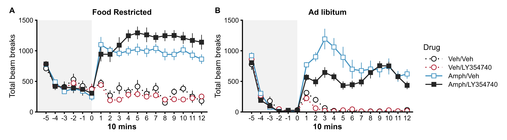
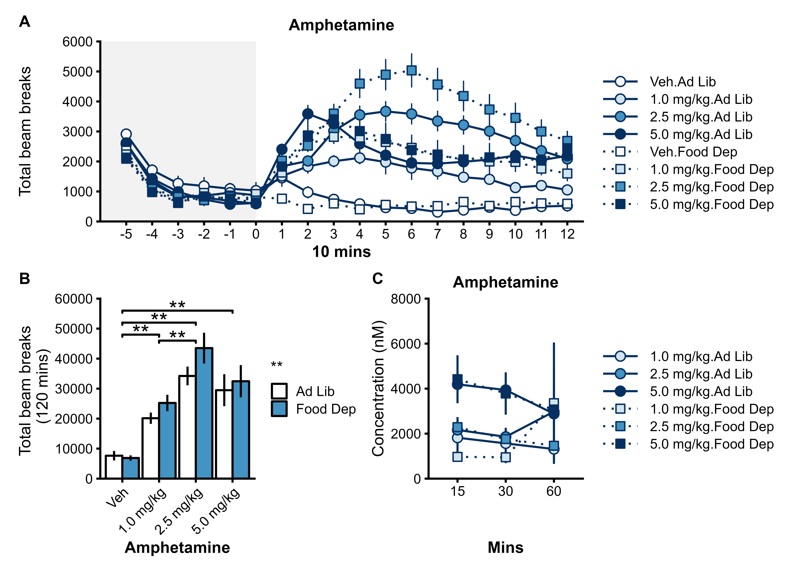

```{r setup, include=FALSE, message = FALSE, warning=FALSE}
knitr::opts_chunk$set(echo = FALSE)
## Packages for data organisation and plotting
library(tidyverse)
# Package for relative file paths
library(here)
# library(ggpubr)
library(cowplot)
library(ggsignif)
library(patchwork)
################################################################################
## Packages for Data analysis
library(afex)
afex_options(emmeans_model = "multivariate")# use multivariate model for all follow-up tests.
library(emmeans)
# install.packages("devtools")
# devtools::install_github("crsh/papaja")
library(papaja)
library(knitr)
# remotes::install_github("noamross/redoc")
# library(redoc)
```

# Results

## Experiment 1: LY354740 impaired spatial working memory in rats

```{r Expt. 1 LY354740 impairs spatial working memory, include=FALSE, message = FALSE, warning=FALSE}

#Load Data
full_data <- read_csv(here("rawdata", "/LY354740_TMaze_Expt1_rawdata.csv")) 
# Delay 0s data only
short_data <- full_data %>% 
  filter(Delay == "0")


# Stats - Accuracy
anova <- aov_4(Accuracy ~ (Drug|Subj), data = short_data, anova_table = list(correction = "none", es = "pes"))
anova_print <- apa_print(anova, mse = "FALSE",correction = "none",es = "pes")

simpledrug <- emmeans(anova, ~Drug)
simpledrug_print <- apa_print.emmGrid(contrast(simpledrug, method = "pairwise", simple = "Drug", adjust = "tukey"))

# Stats - Latency Sample
anova_latencySample <- aov_4(Latency_Sample ~ (Drug|Subj), data = short_data, anova_table = list(correction = "none", es = "pes"))
anova_latencySample_print <- apa_print(anova_latencySample, mse = "FALSE",correction = "none",es = "pes")

simpledrug_latencySample <- emmeans(anova_latencySample, ~Drug)
simpledrug_latencySample_print <- apa_print.emmGrid(contrast(simpledrug_latencySample, method = "pairwise", simple = "Drug", adjust = "tukey"))

# Stats - Latency Choice
# Stats - Latency Choice
anova_latencyChoice <- aov_4(Latency_Choice ~ (Drug|Subj), data = short_data, anova_table = list(correction = "none", es = "pes"))
anova_latencyChoice_print <- apa_print(anova_latencyChoice, mse = "FALSE",correction = "none",es = "pes")

simpledrug_latencyChoice <- emmeans(anova_latencyChoice, ~Drug)
simpledrug_latencyChoice_print <- apa_print.emmGrid(contrast(simpledrug_latencyChoice, method = "pairwise", simple = "Drug", adjust = "tukey"))

# anova_print$table
# simpledrug_print$table
# 
# anova_latencySample_print$table
# simpledrug_latencySample_print$table
# 
# anova_latencyChoice_print$table
# simpledrug_latencyChoice_print$table

```

We first established an active dose of the group II metabotropic agonist in our testing environment. Rats were injected with LY354740 intraperitoneally (i.p.) at a dose of either 1 mg/kg or 10 mg/kg, 45-50 min before behavioural testing. Two control conditions consisted of a no injection (No Inj) control and a distilled water (Veh) injected condition (1 ml/kg). Rewarded alternation a T-maze was used to assess spatial working memory, and was conducted as a within-subject design.

In agreement with previous reports [REF], an i.p. dose of 10 mg/kg LY354740 decreased spatial working memory performance (Fig. 1A-C; main effect of Drug on Accuracy `r anova_print$statistic$Drug`, Sample Latency `r anova_latencySample_print$statistic$Drug`, Choice Latency `r anova_latencyChoice_print$statistic$Drug`). This dose significantly reduced accuracy (Fig. 1A; No Inj vs 10 mg/kg `r simpledrug_print$statistic$NoInj_X10mgkg`, Veh vs 10 mg/kg `r simpledrug_print$statistic$Veh_X10mgkg`), and an increased latencies during the sample (Fig. 1B; No Inj vs 10 mg/kg `r simpledrug_latencySample_print$statistic$NoInj_X10mgkg`, Veh vs 10 mg/kg `r simpledrug_latencySample_print$statistic$Veh_X10mgkg`, 1 vs 10 mg/kg `r simpledrug_latencySample_print$statistic$x1mgkg_x10mgkg`) and choice phases (Fig. 1C; No Inj vs 10 mg/kg `r simpledrug_latencyChoice_print$statistic$NoInj_X10mgkg`).

## Experiment 2: LY354740 enhanced the effects of amphetamine on spatial working memory

```{r Expt. 2 LY354740 exacerbates amphetamine induced deficits in spatial working memory, include=FALSE, message = FALSE, warning=FALSE}

short_data <- read_csv(here("rawdata", "/LY354740_Amph_TMaze_Expt2_rawdata.csv")) 


# Stats - Accuracy
anova <- aov_4(Accuracy ~ (Drug|Subj), data = short_data, anova_table = list(correction = "none", es = "pes"))
anova_print <- apa_print(anova, mse = "FALSE",correction = "none",es = "pes")

simpledrug <- emmeans(anova, ~Drug)
simpledrug_print <- apa_print.emmGrid(contrast(simpledrug, method = "pairwise", simple = "Drug", adjust = "tukey"))

# Stats - Latency Sample
anova_latencySample <- aov_4(Latency_Sample ~ (Drug|Subj), data = short_data, anova_table = list(correction = "none", es = "pes"))
anova_latencySample_print <- apa_print(anova_latencySample, mse = "FALSE",correction = "none",es = "pes")

simpledrug_latencySample <- emmeans(anova_latencySample, ~Drug)
simpledrug_latencySample_print <- apa_print.emmGrid(contrast(simpledrug_latencySample, method = "pairwise", simple = "Drug", adjust = "tukey"))

# Stats - Latency Choice
# Stats - Latency Choice
anova_latencyChoice <- aov_4(Latency_Choice ~ (Drug|Subj), data = short_data, anova_table = list(correction = "none", es = "pes"))
anova_latencyChoice_print <- apa_print(anova_latencyChoice, mse = "FALSE",correction = "none",es = "pes")

simpledrug_latencyChoice <- emmeans(anova_latencyChoice, ~Drug)
simpledrug_latencyChoice_print <- apa_print.emmGrid(contrast(simpledrug_latencyChoice, method = "pairwise", simple = "Drug", adjust = "tukey"))

#Accuracy
anova_print$table
simpledrug_print$table
#Sample - Latency
anova_latencySample_print$table
simpledrug_latencySample_print$table
#Choice - Latency
anova_latencyChoice_print$table
simpledrug_latencyChoice_print$table

```

Having established an active dose of LY354740, we next investigated whether the metabotropic agonist could rescue spatial working memory deficits induced by amphetamine [REF]. The same cohort of rats tested on the T-maze in experiment 1 was used in this rewarded alternation experiment with amphetamine. Rats received two consecutive i.p. injections 45-50 min before behavioural testing. They received either Veh/Veh, Amph (2.5 mg/kg)/Veh, or Amph (2.5mg/kg)/LY354740 (10 mg/kg) in a within-subjects design. *One rat had to be excluded because it failed to run on the maze in the LY354740/AMPH condition.*

Overall, drug injections significantly disrupted all three performance measures on the spatial working memory task (Fig. 1D-F; main effect of Drug on Accuracy `r anova_print$statistic$Drug`, Sample Latency `r anova_latencySample_print$statistic$Drug`, Choice Latency `r anova_latencyChoice_print$statistic$Drug`). Compared to vehicle injections, amphetamine disrupted performance on the spatial working memory task, surprisingly given previous findings [REF] (Aultman and Moghaddam, 2001) this effect was only statistically robust for response latencies during the choice period (Veh/Veh vs Amph/veh: Accuracy `r simpledrug_print$statistic$Veh_Veh_Amph_Veh`), Sample Latency `r simpledrug_latencySample_print$statistic$Veh_Veh_Amph_Veh`, Choice Latency `r simpledrug_latencyChoice_print$statistic$Veh_Veh_Amph_Veh`). This deficit, at least in part, reflected an increase in undirected exploratory behaviours (e.g. sniffing and rearing) in the start arm, at the expense of performing the appetitively motivated memory task. However, rather than ameliorating these effects of amphetamine as might have been expected based on previous studies [REF], combining LY354740 and amphetamine significantly impaired accuracy (Fig. 1D; Veh/Veh vs Amph/LY354740 `r simpledrug_print$statistic$Veh_Veh_Amph_LY`, Amph/Veh vs Amph/LY354740 `r simpledrug_print$statistic$Amph_Veh_Amph_LY`), and increased response latencies during both the sample (Fig. 1E; Veh/Veh vs Amph/LY354740 `r simpledrug_latencySample_print$statistic$Veh_Veh_Amph_LY`, Amph/Veh vs Amph/LY354740 `r simpledrug_latencySample_print$statistic$Amph_Veh_Amph_LY`) and choice periods (Fig. 1F;Veh/Veh vs Amph/LY354740 `r simpledrug_latencyChoice_print$statistic$Veh_Veh_Amph_LY`, Amph/Veh vs Amph/LY354740 `r simpledrug_latencyChoice_print$statistic$Amph_Veh_Amph_LY`). Thus, rather than ameliorating the effects of amphetamine as predicted, LY354740 actually potentiated the effects of the dopaminergic psychomimetic during testing on the T-maze.

```{r Expt. 1/2  Plots - Fig. 1,  results='hide', include=FALSE, message = FALSE, warning=FALSE}
# Run script to generate figure
# Script run separately to minimize clutter
source(here("scripts","figures", "Fig1.R"))

```


**Figure 1**. The effect of LY354740 and amphetamine on spatial working memory in rewarded alternation T-maze assay. Experiment 1 **(A-C)** compared the effects of no injection (No Inj), distilled water (Veh), 1 mg/kg LY354740, and 10 mg/kg LY354740 injected 45-50 mins prior to testing (within-subjects design). Experiment 2 **(D-F)** compared the effects of  2.5 mg/kg amphetamine alone (Amph/Veh) or in combination with 10 mg/kg of LY354740 (Amph/LY354740) injected 45-50 mins prior to testing (within-subjects design). The same cohort of rats was used in Experiment 1 and Experiment 2. **(A,D)** Performance accuracy measured as the proportion of trials with a correct side alternation from sample to choice. Latency (s) to enter the left or right arm of the T-maze during the sample **(B,E)**  and choice **(C,F)** periods. Error bars represent +/- SEM. Statitsical significance of post-hoc simple effects (Tukey corrected) following a significant main effect of Drug: \* = *p* < .05, \*\* = *p* < .001.


## Experiment 3: LY354740 enhanced amphetamine-induced hyperlocomotion in food restricted rats

```{r Expt. 3 Locomotor Activity Food Dep LY & Amph - 10 mins, include=FALSE, message = FALSE, warning=FALSE}
full_data <- read_csv(here("rawdata", "/LY354740_Expt3_Locomotor_FoodDep.csv"))

#####
## Baseline data
baseline_data_10mins <- full_data %>% 
  group_by(Subj, Drug, Amph, LY, Period, bin10mins) %>% 
  summarise(activity = sum(activity)) %>%
    ungroup() %>% 
    group_by(Subj) %>% 
        mutate(activity_perc = activity/activity[bin10mins=="0"]) %>% 
  ungroup() %>% 
  filter(bin10mins < 1) %>% 
  mutate(bin10mins = as.factor(bin10mins))

# Stats - 10 mins
anova_baseline <- aov_4(activity ~ Amph*LY + (bin10mins|Subj), data = baseline_data_10mins, anova_table = list(correction = "none", es = "pes"))
anova_baselineprint <- apa_print(anova_baseline, mse = "FALSE",correction = "none",es = "pes")

#####

data_10mins <- full_data %>% 
  group_by(Subj, Drug, Amph, LY, Period, bin10mins) %>% 
  summarise(activity = sum(activity)) %>%
    ungroup() %>% 
    group_by(Subj) %>% 
        mutate(activity_perc = activity/activity[bin10mins=="0"]) %>% 
  ungroup() %>% 
  filter(bin10mins < 13 &
           bin10mins > 0) %>% 
  mutate(bin10mins = as.factor(bin10mins))

data_60mins <- full_data %>% 
  group_by(Subj, Drug, Amph, LY, Period, bin60mins) %>% 
  summarise(activity = sum(activity)) %>%
    ungroup() %>% 
    group_by(Subj) %>% 
        mutate(activity_perc = activity/activity[bin60mins=="0"]) %>% 
  ungroup() %>% 
  filter(bin60mins < 3 &
           bin60mins > 0) %>% 
  mutate(bin60mins = as.factor(bin60mins))


# Stats - 10 mins
anova <- aov_4(activity ~ Amph*LY + (bin10mins|Subj), data = data_10mins, anova_table = list(correction = "none", es = "pes"))
anova_print <- apa_print(anova, mse = "FALSE",correction = "none",es = "pes")

simple <- emmeans(anova, ~Amph*LY*bin10mins)
simple_print <- apa_print.emmGrid(contrast(simple, by = "bin10mins", interaction = "pairwise", adjust = "tukey"))

simple2 <- emmeans(anova, ~Amph*LY*bin10mins)
simple2_print <- apa_print.emmGrid(contrast(simple2, by = c("Amph","bin10mins"), interaction = "pairwise", adjust = "tukey"))


# Stats - 60 mins follow up tests
anova_60 <- aov_4(activity ~ Amph*LY + (bin60mins|Subj), data = data_60mins, anova_table = list(correction = "none", es = "pes"))
anova_60_print <- apa_print(anova_60, mse = "FALSE",correction = "none",es = "pes")

simple_60 <- emmeans(anova_60, ~Amph*LY*bin60mins)
simple_60_print <- apa_print.emmGrid(contrast(simple_60, by = "bin60mins", interaction = "pairwise", adjust = "tukey"))

simple2_60 <- emmeans(anova_60, ~Amph*LY*bin60mins)
simple2_60_print <- apa_print.emmGrid(contrast(simple2_60, by = c("Amph","bin60mins"), interaction = "pairwise", adjust = "tukey"))


#####
#
anova_baselineprint$table
#
anova_print$table
# 
simple_60_print$table
# 
simple2_60_print$table


```

Numerous previous studies have shown that group II metabotropic mGluR agonists, including LY354740, reduce the locomotor hyperactivity induced by amphetamine (Cartmell et al., 1999, Kim and Vezina, 2002, Galici et al., 2005, Rorick-Kehn et al., 2007, Woolley et al., 2008, Pehrson and Moghaddam, 2010). Given our unexpected findings on the T-maze, with LY354740 appearing to exacerbate the effects of amphetamine, we next assessed the effects of the mGluR agonist on amphetamine-induced hyperactivity in locomotor activity cages, in these same animals while still on food restriction. As expected, amphetamine (2.5 mg/kg) significantly increased locomotor activity (main effect of Amph `r anova_print$statistic$Amph`, Amph x Time `r anova_print$statistic$Amph_bin10mins`). Surprsingly, LY354740 (10 mg/kg) significantly enhanced this amphetamine-induced hyperactivity over time rather than reduce it (Amph x LY354740 x Time `r anova_print$statistic$Amph_LY_bin10mins`, Amph x LY354740 `r anova_print$statistic$Amph_LY_bin10mins`). Specifically, LY354740 significantly increased Amph induced hyperactivity 61-120 mins post injection (Amph/LY354740 vs Amph/Veh `r simple2_60_print$statistic$LY_Veh_Amph_X2`) but not 1-60 mins post injection (`r simple2_60_print$statistic$LY_Veh_Amph_X1`). In contrast, LY354740 alone did not affect locomotor activity (Veh/LY354740 vs Veh/Veh, 1-60 mins `r simple2_60_print$statistic$LY_Veh_Veh_X1`, 61-120 mins `r simple2_60_print$statistic$LY_Veh_Veh_X2`). This enhancement is the effect of amphetamine is consistent with the effects on running latencies on the T-maze (Experiment 2, Fig. 1B), but at odds with the previously published results.


## Experiment 4: LY354740 reduced amphetamine-induced hyperlocomotion in ad libitum fed rats


```{r Expt. 4 Locomotor Activity AdLib LY & Amph - 10 mins, include=FALSE, message = FALSE, warning=FALSE}
full_data <- read_csv(here("rawdata", "/LY354740_Expt4_Locomotor_AdLib.csv"))

#####
## Baseline data
baseline_data_10mins <- full_data %>% 
  group_by(Subj, Drug, Amph, LY, Period, bin10mins) %>% 
  summarise(activity = sum(activity)) %>%
    ungroup() %>% 
    group_by(Subj) %>% 
        mutate(activity_perc = activity/activity[bin10mins=="0"]) %>% 
  ungroup() %>% 
  filter(bin10mins < 1) %>% 
  mutate(bin10mins = as.factor(bin10mins))

# Stats - 10 mins
anova_baseline <- aov_4(activity ~ Amph*LY + (bin10mins|Subj), data = baseline_data_10mins, anova_table = list(correction = "none", es = "pes"))
anova_baselineprint <- apa_print(anova_baseline, mse = "FALSE",correction = "none",es = "pes")

#####

data_10mins <- full_data %>% 
  group_by(Subj, Drug, Amph, LY, Period, bin10mins) %>% 
  summarise(activity = sum(activity)) %>%
    ungroup() %>% 
    group_by(Subj) %>% 
        mutate(activity_perc = activity/activity[bin10mins=="0"]) %>% 
  ungroup() %>% 
  filter(bin10mins < 13 &
           bin10mins > 0) %>% 
  mutate(bin10mins = as.factor(bin10mins))

data_60mins <- full_data %>% 
  group_by(Subj, Drug, Amph, LY, Period, bin60mins) %>% 
  summarise(activity = sum(activity)) %>%
    ungroup() %>% 
    group_by(Subj) %>% 
        mutate(activity_perc = activity/activity[bin60mins=="0"]) %>% 
  ungroup() %>% 
  filter(bin60mins < 3 &
           bin60mins > 0) %>% 
  mutate(bin60mins = as.factor(bin60mins))


# Stats - 10 mins
anova <- aov_4(activity ~ Amph*LY + (bin10mins|Subj), data = data_10mins, anova_table = list(correction = "none", es = "pes"))
anova_print <- apa_print(anova, mse = "FALSE",correction = "none",es = "pes")

simple <- emmeans(anova, ~Amph*LY*bin10mins)
simple_print <- apa_print.emmGrid(contrast(simple, by = "bin10mins", interaction = "pairwise", adjust = "tukey"))

simple2 <- emmeans(anova, ~Amph*LY*bin10mins)
simple2_print <- apa_print.emmGrid(contrast(simple2, by = c("Amph","bin10mins"), interaction = "pairwise", adjust = "tukey"))


# Stats - 60 mins follow up tests
anova_60 <- aov_4(activity ~ Amph*LY + (bin60mins|Subj), data = data_60mins, anova_table = list(correction = "none", es = "pes"))
anova_60_print <- apa_print(anova_60, mse = "FALSE",correction = "none",es = "pes")

simple_60 <- emmeans(anova_60, ~Amph*LY*bin60mins)
simple_60_print <- apa_print.emmGrid(contrast(simple_60, by = "bin60mins", interaction = "pairwise", adjust = "tukey"))

simple2_60 <- emmeans(anova_60, ~Amph*LY*bin60mins)
simple2_60_print <- apa_print.emmGrid(contrast(simple2_60, by = c("Amph","bin60mins"), interaction = "pairwise", adjust = "tukey"))


#####
# #
# anova_baselineprint$table
# #
# anova_print$table
# # 
# simple_60_print$table
# # 
# simple2_60_print$table

```

Given these surprising results, we then re-assessed the effects of LY354740 on amphetamine-induced locomotor hyperactivity in a separate cohort of experimentally naïve rats maintained with ad libitum access to food. In agreement with the previous reports in the literature (e.g. Cartmell et al., 1999), LY354740 (10 mg/kg) now did reduce the hyperactivity following amphetamine (2.5 mg/kg) administration in these animals (Fig. 2B).

As expected, amphetamine significantly increased locomotor activity (Amph `r anova_print$statistic$Amph`, Amph x Time `r anova_print$statistic$Amph_bin10mins`), an effect which was significantly reduced by LY354740 (Amph x LY354740 x Time `r anova_print$statistic$Amph_LY_bin10mins`, Amph x LY354740 `r anova_print$statistic$Amph_LY_bin10mins`). Specifically, LY354740 significantly reduced Amph induced hyperactivity 1-60 mins post injection (Amph/LY354740 vs Amph/Veh `r simple2_60_print$statistic$LY_Veh_Amph_X1`) but not 61-120 mins post injection (`r simple2_60_print$statistic$LY_Veh_Amph_X2`). In contrast, LY354740 alone did not affect locomotor activity (Veh/LY354740 vs Veh/Veh, 1-60 mins `r simple2_60_print$statistic$LY_Veh_Veh_X1`, 61-120 mins `r simple2_60_print$statistic$LY_Veh_Veh_X2`).


```{r Expt. 3/4  Plots - Fig. 2,  results='hide', include=FALSE, message = FALSE, warning=FALSE}
# Run script to generate figure
# Script run separately to minimize clutter
source(here("scripts","figures", "Fig2.R"))

```



**Figure 2**. The effect of LY354740 and amphetamine on locomotor activity in **(A)** food restricted (experiment 3) and **(B)** ad libitum fed rats (experiment 4). Activity was measured by the number of infra-red beam breaks in locomotor activity arena. Time is presented in bins of 10 minutes relative to the time of injection, and the pre-injection 60 min period of habituation to the locomotor box is indicated by light grey highlight (left). Rats received injections consisting of either vehicle (Veh/Veh), vehicle and 10 mg/kg LY354740 (Veh/LY354740), vehicle and 2.5 mg/kg amphetamine (Amph/Veh), 2.5 mg/kg amphetamine and 10 mg/kg LY354740 (Amph/LY354740). Error bars represent +/- SEM. Statitsical significance of post-hoc simple effects (Tukey corrected), following significant interactions, were conducted on contrasts aggregating over 60 minute time bins (i.e. bins 1-6 and 7-12) to minimise family-wise error rate inflation with repeated testing: \* = *p* < .05, \*\* = *p* < .001.


## Experiment 5: LY354740 increased phasic dopamine responses in the nucleus accumbens to reward

Taken together, these results suggest that LY354740 can exert bidirectional effects on the dopamine system, depending on the behavioural state of the animal. The mGluR agonist reduced the locomotor response to amphetamine in ad-libitum maintained animals, but enhanced the locomotor response to amphetamine in food restricted animals that were expecting food, suggesting that under some conditions LY354740 might actually potentiate dopamine signalling. To test this hypothesis directly, we used fast-scan cyclic voltammetry (FCV) to measure phasic dopamine responses in the nucleus accumbens (NAc) core to unsignalled food rewards in food-restricted rats. Rats were placed into operant chambers and received unsignalled rewards of three different magnitudes delivered into a food magazine. Phasic dopamine responses event-locked to reward delivery were recorded. Data were obtained from N = 18 working electrodes, successfully located in the nucleus accumbens core (n = 11 rats, n = 7 rats with bilateral, and n = 4 with unilateral working electrodes).

```{r EXpt5 Awake FCV LY354740, echo=FALSE,message = FALSE, warning=FALSE}
## General comment for David - Within Session habituation of signal not really different between Drug conditions, data are a bit messy but clear absence of differences in time-course on all 3 measures.

#Read in the data as global variable
full_data <- read_csv("../rawdata/AwakeVarReward_rawdata.csv")
#Pre filter data for any exclusions
full_data <- full_data %>% 
  filter(include == TRUE)

#Filter the relevant stage of data for analysis
data_subset <- full_data 

### Peak
Peakanova <- aov_4(peak ~ (drug*rewardMagnitude|Subj), data = data_subset, anova_table = list(correction = "none", es = "pes"))

Peakanova_print <- apa_print(Peakanova, mse = "FALSE",correction = "none",es = "pes")

Peaksimple <- emmeans(Peakanova, ~rewardMagnitude)
Peaksimple_print <- apa_print.emmGrid(pairs(Peaksimple, adjust = "tukey"))

Peaksimple2 <- emmeans(Peakanova, ~drug*rewardMagnitude)
Peaksimple2_print <- apa_print.emmGrid(contrast(Peaksimple2, by = "rewardMagnitude", interaction = "pairwise", adjust = "tukey"))

### AUC
AUCanova <- aov_4(AUC ~ (drug*rewardMagnitude|Subj), data = data_subset, anova_table = list(correction = "none", es = "pes"))

AUCanova_print <- apa_print(AUCanova, mse = "FALSE",correction = "none",es = "pes")

AUCsimple <- emmeans(AUCanova, ~rewardMagnitude)
AUCsimple_print <- apa_print.emmGrid(pairs(AUCsimple, adjust = "tukey"))

AUCsimple2 <- emmeans(AUCanova, ~drug*rewardMagnitude)
AUCsimple2_print <- apa_print.emmGrid(contrast(AUCsimple2, by = "rewardMagnitude", interaction = "pairwise", adjust = "tukey"))

### Latency
Latencyanova <- aov_4(latency2peak ~ (drug*rewardMagnitude|Subj), data = data_subset, anova_table = list(correction = "none", es = "pes"))

Latencyanova_print <- apa_print(Latencyanova, mse = "FALSE",correction = "none",es = "pes")

Latencysimple <- emmeans(Latencyanova, ~rewardMagnitude)
Latencysimple_print <- apa_print.emmGrid(pairs(Latencysimple, adjust = "tukey"))

Latencysimple2 <- emmeans(Latencyanova, ~drug*rewardMagnitude)
Latencysimple2_print <- apa_print.emmGrid(contrast(Latencysimple2, by = "rewardMagnitude", interaction = "pairwise", adjust = "tukey"))


##### 
# Load in raw data for behaviour separately
data_behaviour <- read_csv("../rawdata/AwakeVarReward_behaviour_rawdata.csv")
#Pre filter data for any exclusions
data_behaviour <- data_behaviour %>% 
  filter(include == TRUE) %>% 
  group_by(subject, drug) %>% 
  summarise(MagEntry = mean(MagFrequency))


# tstats <- compare.2.vectors(data_subset$MagEntry[data_subset$drug == "SAL"], data_subset$MagEntry[data_subset$drug == "LY"], paired = TRUE)

tstats <- with(data_behaviour, t.test(MagEntry[drug == "SAL"], MagEntry[drug == "LY"], paired = TRUE, tests = "parametric"))

tstats_print <- apa_print(tstats)

# Load in raw data for latency behaviour separately
data_behaviour <- read_csv("../rawdata/LY354740_Rat_awake_behaviour_latencies.csv")
#Pre filter data for any exclusions - convert latencies into seconds
data_latencies <- data_behaviour %>% 
  mutate(responselatency = responselatency/10) %>% 
  filter(includeSubj == TRUE,
         trialexclude == FALSE,
         uniqueID %in% c('29_20130227_1_SAL','29_20130301_1_LY','32_20130227_1_LY','32_20130301_1_SAL','34_20130227_1_LY','34_20130301_1_SAL','52_20130911_1_SAL','52_20130913_1_LY','54_20140617_1_LY','54_20140619_1_SAL','55_20140617_1_SAL','55_20140619_1_LY','56_20140617_0_LY','56_20140619_0_SAL','57_20140618_1_SAL','57_20140620_1_LY','69_20141209_1_LY','69_20141211_1_SAL','72_20141210_1_LY','72_20141212_1_SAL'))

# FIlter out repeated behavioural data from rats with more than one working channel
total_latencies <- data_latencies %>% 
  group_by(subject, drug) %>% 
  summarise(Latency_median = median(responselatency, na.rm=TRUE),
            MagEntry10sPre = mean(MagEntry10sPre, na.rm=TRUE),
            MagEntry10sPost = mean(MagEntry10sPost, na.rm=TRUE))

# Ttests

tstats_latency <- with(total_latencies, t.test(Latency_median[drug == "SAL"], Latency_median[drug == "LY"], paired = TRUE, tests = "parametric"))

tstats_latency_print <- apa_print(tstats_latency)


tstats_MagEntry10sPost <- with(total_latencies, t.test(MagEntry10sPost[drug == "SAL"], MagEntry10sPost[drug == "LY"], paired = TRUE, tests = "parametric"))

tstats_MagEntry10sPost_print <- apa_print(tstats_MagEntry10sPost)

tstats_MagEntry10sPre <- with(total_latencies, t.test(MagEntry10sPre[drug == "SAL"], MagEntry10sPre[drug == "LY"], paired = TRUE, tests = "parametric"))

tstats_MagEntry10sPre_print <- apa_print(tstats_MagEntry10sPre)


```

LY354740 increased phasic dopamine release in the nucleus accumbens in response to unsignalled reward (Fig. 3A). Peak DA release (Fig. 3B) increased with reward size (Size: `r Peakanova_print$statistic$rewardMagnitude`; small vs medium `r Peaksimple_print$statistic$X1_X2`, medium vs large `r Peaksimple_print$statistic$X2_X3`), and was significantly higher following LY354740 (Drug: `r Peakanova_print$statistic$drug`, Drug x Size: `r Peakanova_print$statistic$drug_rewardMagnitude`). Total DA release, measured as the area under the curve (AUC; Fig. 3C), increased with reward size (Size: `r AUCanova_print$statistic$rewardMagnitude`; small vs medium `r AUCsimple_print$statistic$X1_X2`, medium vs large `r AUCsimple_print$statistic$X2_X3`), and was significantly higher following LY354740 (Drug: `r AUCanova_print$statistic$drug`). Furthermore, the LY354740 increase was greater as reward size increased (Drug x Size: `r AUCanova_print$statistic$drug_rewardMagnitude`; Sal vs LY: Small `r AUCsimple2_print$statistic$SAL_LY_X1`, Medium `r AUCsimple2_print$statistic$SAL_LY_X2`, Large `r AUCsimple2_print$statistic$SAL_LY_X3`). In contrast to the total and peak levels of DA, the latency to peak DA (Fig. 3D) was unaffected by LY354740 (Drug: `r Latencyanova_print$statistic$drug`, Drug x Size: `r Latencyanova_print$statistic$drug_rewardMagnitude`), but increased with reward size (Size: `r Latencyanova_print$statistic$rewardMagnitude`; small vs medium `r Latencysimple_print$statistic$X1_X2`, medium vs large `r Latencysimple_print$statistic$X2_X3`). 

This profile of LY354740 enhanced DA release in response to reward in food restricted animals is consistent with the effects of LY354740 enhancing the amphetamine-induced hyperlocomotion in food restricted animals (Fig. 2A; Experiment 3). However, unlike amphetamine, 10 mg/kg LY354740 does not produce significant increases in general locomotor activity that might account for this enhanced DA release, which was also supported by no significant effect of LY354740 on the magazine apprach behaviour across the entire recording session (FIG), or in the 10s immediately prior to reward delivery (FIG). Furthermore, the latency between reward delivery and reward collection was not significantly different following LY354740 (FIG).

Total magazine approach behaviour did not differ between Saline and LY354740 sessions (Sal vs LY paired t-test, `r tstats_print$statistic`). Similarly the average rate of maagazine approach immediately prior to reward delivery did not differ between Saline and LY354740 (`r tstats_MagEntry10sPre_print$statistic`). Latency to receive the reward was also similar between Saline and LY354740 (`r tstats_latency_print$statistic`).

**Enhanced DA release is consistent with amphetamine on DA response to unsignalled reward, except LY354740 did not cause any of the concomitant behavioural differences here (magazine frequency), or enhanced locomotor activity.
Even though LY354740 increased response latencies during the sample and choice phase of the T-Maze there is no evidence that this was the case here as this would be reflected in latency to peak. No running requirement so no reason this effect should influence reward collection.**


## Experiment 6: LY354740 did not affect phasic dopamine responses in the nucleus accumbens in anaesthetised rats


```{r EXpt6 Anaesthetized FCV LY354740, echo=FALSE,message = FALSE, warning=FALSE}

full_data <- read_csv("../rawdata/Anaesthetized_rawdata.csv")

# Pre vs Post Injection Analysis - Raw
# Filter the relevant stage of data for analysis
data_subset <- full_data %>% 
  filter(ExperimentalStage == "04_Baseline2_Pre" | ExperimentalStage == "05_Baseline_Post") %>% 
  separate(ExperimentalStage, c("stagenumber", "stagename", "injectiontime"))

## Peak DA

anova <- aov_4(DA_max ~ drugs + (injectiontime|subj), data = data_subset, anova_table = list(correction = "none", es = "pes"))

anova_print_PrePost_Peak <- apa_print(anova, mse = "FALSE",correction = "none",es = "pes")


simple <- emmeans(anova, ~drugs*injectiontime)
simple_print_PrePost_Peak <- apa_print.emmGrid(contrast(simple, by = "drugs", interaction = "pairwise", adjust = "tukey"))

## AUC

anova <- aov_4(DA_AUC ~ drugs + (injectiontime|subj), data = data_subset, anova_table = list(correction = "none", es = "pes"))

anova_print_PrePost_AUC <- apa_print(anova, mse = "FALSE",correction = "none",es = "pes")

simple <- emmeans(anova, ~drugs*injectiontime)
simple_print_PrePost_AUC <- apa_print.emmGrid(contrast(simple, by = "drugs", interaction = "pairwise", adjust = "tukey"))


## Latency

anova <- aov_4(DA_Latency_s ~ drugs + (injectiontime|subj), data = data_subset, anova_table = list(correction = "none", es = "pes"))

anova_print_PrePost_Latency <- apa_print(anova, mse = "FALSE",correction = "none",es = "pes")


# Stim Intensity Curve

#Filter the relevant stage of data for analysis
data_subset <- full_data %>% 
  filter(ExperimentalStage == "06_StimIntensity_Post")


## Peak DA 
anova <- aov_4(DA_max_PercBaseline ~ drugs + (stimStrength|subj), data = data_subset, anova_table = list(correction = "none", es = "pes"))

anova_print_Intenisty_Peak_Perc <- apa_print(anova, mse = "FALSE",correction = "none",es = "pes")


simple <- emmeans(anova, ~stimStrength)
simple_print_Intenisty_Peak_Perc  <- apa_print.emmGrid(pairs(simple, adjust = "tukey"))


## AUC
anova <- aov_4(DA_AUC_PercBaseline ~ drugs + (stimStrength|subj), data = data_subset, anova_table = list(correction = "none", es = "pes"))

anova_print_Intenisty_AUC_Perc <- apa_print(anova, mse = "FALSE",correction = "none",es = "pes")


simple <- emmeans(anova, ~stimStrength)
simple_print_Intenisty_AUC_Perc <- apa_print.emmGrid(pairs(simple, adjust = "tukey"))

## Latency
anova <- aov_4(DA_Latency_s_PercBaseline ~ drugs + (stimStrength|subj), data = data_subset, anova_table = list(correction = "none", es = "pes"))

anova_print_Intensity_Latency_Perc <- apa_print(anova, mse = "FALSE",correction = "none",es = "pes")


simple <- emmeans(anova, ~stimStrength)
simple_printt_Intensity_Latency_Perc <- apa_print.emmGrid(pairs(simple, adjust = "tukey"))

# Stim Pulses Curve
#Filter the relevant stage of data for analysis
data_subset <- full_data %>% 
  filter(ExperimentalStage == "07_StimPulses_Post")

## Peak DA
anova <- aov_4(DA_max_PercBaseline ~ drugs + (stimPulses|subj), data = data_subset, anova_table = list(correction = "none", es = "pes"))

anova_print_Pulse_Peak_Perc <- apa_print(anova, mse = "FALSE",correction = "none",es = "pes")


simple <- emmeans(anova, ~stimPulses)
simple_print_Pulse_Peak_Perc <- apa_print.emmGrid(pairs(simple, adjust = "tukey"))

## AUC
anova <- aov_4(DA_AUC_PercBaseline ~ drugs + (stimPulses|subj), data = data_subset, anova_table = list(correction = "none", es = "pes"))

anova_print_Pulse_AUC_Perc <- apa_print(anova, mse = "FALSE",correction = "none",es = "pes")


simple <- emmeans(anova, ~stimPulses)
simple_print_Pulse_AUC_Perc  <- apa_print.emmGrid(pairs(simple, adjust = "tukey"))

## Latency
anova <- aov_4(DA_Latency_s_PercBaseline ~ drugs + (stimPulses|subj), data = data_subset, anova_table = list(correction = "none", es = "pes"))

anova_print_Pulse_Latency_Perc <- apa_print(anova, mse = "FALSE",correction = "none",es = "pes")


simple <- emmeans(anova, ~stimPulses)
simple_print_Pulse_Latency_Perc <- apa_print.emmGrid(pairs(simple, adjust = "tukey"))


```

LY354740 enhanced striatal DA release to natural rewards in food restricted rats. It is possible that this effect occurs via glutamatergic modulation of the mesolimbic reward pathway. To assess this directly we electrically stimulated the VTA in anaesthetized rats to determine whether 10 mg/kg LY354740 enhances DA release in the accumbens (Fig. 4A). Overall, there was no sigificant evidence of an increase in DA release in mesolimbic DA 30 mins post LY354740 injection (Fig 4B) across a range of metrics of DA release properties (Fig. 4C-E). While there was no evidence to suggest that LY354740 increased DA release, the data suggest that LY354740 may have decreased DA release (Fig 4C; Peak DA: Pre vs Post LY354740 `r simple_print_PrePost_Peak$statistic$Pre_Post_LY`, Pre vs Post Saline `r simple_print_PrePost_Peak$statistic$Pre_Post_SAL`), however this was not statistically supported by an interaction. Peak DA decreased from pre- to post-injection (Fig. 4C; Period `r anova_print_PrePost_Peak$statistic$injectiontime`), however this was not significantly modulated by LY3454740 or Saline (Drug `r anova_print_PrePost_Peak$statistic$drugs`; Drug x Period `r anova_print_PrePost_Peak$statistic$drugs_injectiontime`). Similalry, AUC was not significantly modulated by LY3454740 or Saline (Fig. 4D; Drug `r anova_print_PrePost_AUC$statistic$drugs`; Period `r anova_print_PrePost_AUC$statistic$injectiontime`; Drug x Period `r anova_print_PrePost_AUC$statistic$drugs_injectiontime`). Latency to peak DA was also not significantly modulated by LY3454740 or Saline (Fig. 4E; Drug `r anova_print_PrePost_Latency$statistic$drugs`; Period `r anova_print_PrePost_Latency$statistic$injectiontime`; Drug x Period `r anova_print_PrePost_Latency$statistic$drugs_injectiontime`). 

The effect of LY354740 on the sensitivity of the mesolmbic DA system was probed further with a range of stimulation parameters, and expressed as a percentage of post injection levels (i.e. levels in Fig 4.C-E; raw values presented in supplementary Fig. S4). First, manipulating stimulus intensity resulted in a proportional increase in DA release (Fig. 4F-H), but did not differ between saline and LY354740 treated rats. Peak DA increased with stimulation intensity (Fig. 4F; Intensity: `r anova_print_Intenisty_Peak_Perc$statistic$stimStrength`; 100 vs 200 `r simple_print_Intenisty_Peak_Perc$statistic$X100_X200`, 200 vs 300 `r simple_print_Intenisty_Peak_Perc$statistic$X200_X300`), but was not modulated by drug condition (Drug: `r anova_print_Intenisty_Peak_Perc$statistic$drugs`, Drug x Intensity: `r anova_print_Intenisty_Peak_Perc$statistic$drugs_stimStrength`). Similarly, AUC increased with stimulation intensity (Fig. 4G; Intensity: `r anova_print_Intenisty_AUC_Perc$statistic$stimStrength`; 100 vs 200 `r simple_print_Intenisty_AUC_Perc$statistic$X100_X200`, 200 vs 300 `r simple_print_Intenisty_AUC_Perc$statistic$X200_X300`), and was not modulated by drug condition (Drug: `r anova_print_Intenisty_AUC_Perc$statistic$drugs`, Drug x Intensity: `r anova_print_Intenisty_AUC_Perc$statistic$drugs_stimStrength`). Latency to peak was not modulated by stimulation intensity (Fig. 4H; Intensity: `r anova_print_Intensity_Latency_Perc$statistic$stimStrength`, or by drug condition (Drug: `r anova_print_Intensity_Latency_Perc$statistic$drugs`, Drug x Intensity: `r anova_print_Intensity_Latency_Perc$statistic$drugs_stimStrength`).

Next, the number of stimulation pulses was varied (Fig. 4I-K), which also led to a proportional increase in DA release and no differences between saline and LY354740 treated rats. Peak DA increased with pulse number (Fig. 4I; Pulses: `r anova_print_Pulse_Peak_Perc$statistic$stimPulses`; 12 vs 24 `r simple_print_Pulse_Peak_Perc$statistic$X12_X24`, 24 vs 36 `r simple_print_Pulse_Peak_Perc$statistic$X24_X36`), but was not modulated by drug condition (Drug: `r anova_print_Pulse_Peak_Perc$statistic$drugs`, Drug x Intensity: `r anova_print_Pulse_Peak_Perc$statistic$drugs_stimPulses`). Similarly, AUC increased with stimulation intensity (Fig. 4J; Pulses: `r anova_print_Pulse_AUC_Perc$statistic$stimPulses`; 12 vs 24 `r simple_print_Pulse_AUC_Perc$statistic$X12_X24`, 24 vs 36 `r simple_print_Pulse_AUC_Perc$statistic$X24_X36`), but was not modulated by drug condition (Drug: `r anova_print_Pulse_AUC_Perc$statistic$drugs`, Drug x Intensity: `r anova_print_Pulse_AUC_Perc$statistic$drugs_stimPulses`). Latency to peak was also modulated by stimulation intensity (Fig. 4K; Pulses: `r anova_print_Pulse_Latency_Perc$statistic$stimPulses`; 12 vs 24 `r simple_print_Pulse_Latency_Perc$statistic$X12_X24`, 24 vs 36 `r simple_print_Pulse_Latency_Perc$statistic$X24_X36`), but was not modulated by drug condition (Drug: `r anova_print_Pulse_Latency_Perc$statistic$drugs`, Drug x Intensity: `r anova_print_Pulse_Latency_Perc$statistic$drugs_stimPulses`).

Overall, LY354740 did not significantly increase mesolimbic DA release in anaesthetized rats, but did significantly enhance DA release to natural rewards in awake food restricted rats. Taken together these results suggest that the effect of LY354740 on the DA system is dependent on the state of organism. Furthermore, these results parallel the surprising diammetric effects of LY354740 on amphetamine induced hyper-locomotion in ad-libitum fed and food restricted rats. 

[REFS - Amphetamine increases DA release - FCV; PCP/LY decrease DA release in slice]


## Supplementary results
### Experiment 1 - 40s delay


```{r Expt. 1 LY354740 40s Delay, include=FALSE, message = FALSE, warning=FALSE}

#Load Data
full_data <- read_csv(here("rawdata", "/LY354740_TMaze_Expt1_rawdata.csv")) 
# Delay 0s data only
short_data <- full_data %>% 
  filter(Delay == "40")


# Stats - Accuracy
anova <- aov_4(Accuracy ~ (Drug|Subj), data = short_data, anova_table = list(correction = "none", es = "pes"))
anova_print <- apa_print(anova, mse = "FALSE",correction = "none",es = "pes")

simpledrug <- emmeans(anova, ~Drug)
simpledrug_print <- apa_print.emmGrid(contrast(simpledrug, method = "pairwise", simple = "Drug", adjust = "tukey"))

# Stats - Latency Sample
anova_latencySample <- aov_4(Latency_Sample ~ (Drug|Subj), data = short_data, anova_table = list(correction = "none", es = "pes"))
anova_latencySample_print <- apa_print(anova_latencySample, mse = "FALSE",correction = "none",es = "pes")

simpledrug_latencySample <- emmeans(anova_latencySample, ~Drug)
simpledrug_latencySample_print <- apa_print.emmGrid(contrast(simpledrug_latencySample, method = "pairwise", simple = "Drug", adjust = "tukey"))

# Stats - Latency Choice
# Stats - Latency Choice
anova_latencyChoice <- aov_4(Latency_Choice ~ (Drug|Subj), data = short_data, anova_table = list(correction = "none", es = "pes"))
anova_latencyChoice_print <- apa_print(anova_latencyChoice, mse = "FALSE",correction = "none",es = "pes")

simpledrug_latencyChoice <- emmeans(anova_latencyChoice, ~Drug)
simpledrug_latencyChoice_print <- apa_print.emmGrid(contrast(simpledrug_latencyChoice, method = "pairwise", simple = "Drug", adjust = "tukey"))

anova_print$table
simpledrug_print$table

anova_latencySample_print$table
simpledrug_latencySample_print$table

anova_latencyChoice_print$table
simpledrug_latencyChoice_print$table

```

Increasing the delay between sample and test to 40s resulted in lower accuracy levels (from approximately 80 to 60% in control conditions, Fig. 1A, Fig. S1A). While there was no significant disruption of accuracy by 10 mg/kg LY354740 (Fig. S1A; main effect of Drug, `r anova_print$statistic$Drug`), response latencies were significantly increased during both the sample and choice periods (Fig. S1B; Sample period main effect of Drug `r anova_latencySample_print$statistic$Drug`; No Inj vs 10 mg/kg `r simpledrug_latencySample_print$statistic$NoInj_X10mgkg`, Veh vs 10 mg/kg `r simpledrug_latencySample_print$statistic$Veh_X10mgkg`, 1 mg/kg vs 10 mg/kg `r simpledrug_latencySample_print$statistic$X1mgkg_X10mgkg`; Choice period main effect of Drug `r anova_latencyChoice_print$statistic$Drug`; No Inj vs 10 mg/kg `r simpledrug_latencyChoice_print$statistic$NoInj_X10mgkg`, Veh vs 10 mg/kg `r simpledrug_latencyChoice_print$statistic$Veh_X10mgkg`, 1 mg/kg vs 10 mg/kg `r simpledrug_latencyChoice_print$statistic$X1mgkg_X10mgkg`).


**Figure S1**. The effect of LY354740 on spatial working memory in rewarded alternation T-maze assay on trials with a 40s delay. Trials with a 40s delay between sample and choice were randomly interleaved  throughout Experiment 1. The effect of either no injection (No Inj), distilled water (Veh), 1 mg/kg LY354740, or 10 mg/kg LY354740 on accuracy and response latencies on these trials are presented here. **(A)** Performance accuracy measured as the proportion of trials with a correct side alternation from sample to choice. Latency (s) to enter the left or right arm of the T-maze during the sample **(B)**  and choice **(C)** periods. Error bars represent +/- SEM. Statitsical significance of post-hoc simple effects (Tukey corrected) following a significant main effect of Drug: \* = *p* < .05, \*\* = *p* < .001.

### Effect of feeding state on amphetamine hyper-locomotion and blood amphetamine levels

```{r Expt. 5 Locomotor Activity AdLib Food Dep & Amph - 10 mins, include=FALSE, message = FALSE, warning=FALSE}
full_data <- read_csv(here("rawdata", "/LY354740_Expt5_Locomotor_FoodDepAmphDose.csv"))

#####
## Baseline data
baseline_data_10mins <- full_data %>% 
  group_by(Subj, Feeding, Amph, bin10mins) %>% 
  summarise(activity = sum(activity)) %>%
    ungroup() %>% 
    group_by(Subj) %>% 
        mutate(activity_perc = activity/activity[bin10mins=="0"]) %>% 
  ungroup() %>% 
  filter(bin10mins < 1) %>% 
  mutate(bin10mins = as.factor(bin10mins))


# Stats - 10 mins
anova_baseline <- aov_4(activity ~ Amph*Feeding + (bin10mins|Subj), data = baseline_data_10mins, anova_table = list(correction = "none", es = "pes"))
anova_baselineprint <- apa_print(anova_baseline, mse = "FALSE",correction = "none",es = "pes")

#####

data_10mins <- full_data %>% 
    group_by(Subj, Feeding, Amph, bin10mins) %>% 
  summarise(activity = sum(activity)) %>%
    ungroup() %>% 
    group_by(Subj) %>% 
        mutate(activity_perc = activity/activity[bin10mins=="0"]) %>% 
  ungroup() %>% 
  filter(bin10mins < 13 &
           bin10mins > 0) %>% 
  mutate(bin10mins = as.factor(bin10mins))


# data_60mins <- full_data %>%
#       group_by(Subj, Feeding, Amph, bin60mins) %>% 
#   summarise(activity = sum(activity)) %>%
#     ungroup() %>% 
#     group_by(Subj) %>% 
#         mutate(activity_perc = activity/activity[bin60mins=="0"]) %>% 
#   ungroup() %>% 
#   filter(bin60mins < 3 &
#            bin60mins > 0) %>% 
#   mutate(bin60mins = as.factor(bin60mins))


# Stats - 10 mins
anova <- aov_4(activity ~ Amph*Feeding + (bin10mins|Subj), data = data_10mins, anova_table = list(correction = "none", es = "pes"))
anova_print <- apa_print(anova, mse = "FALSE",correction = "none",es = "pes")

simple <- emmeans(anova, ~ Amph)
simple_print <- apa_print.emmGrid(contrast(simple, method = "pairwise", adjust = "tukey"))

simple2 <- emmeans(anova, ~Amph*Feeding*bin10mins)
simple2_print <- apa_print.emmGrid(contrast(simple2, by = c("Amph","bin10mins"), interaction = "pairwise", adjust = "tukey"))


# # Stats - 60 mins follow up tests
# anova_60 <- aov_4(activity ~ Amph*Feeding + (bin60mins|Subj), data = data_60mins, anova_table = list(correction = "none", es = "pes"))
# anova_60_print <- apa_print(anova_60, mse = "FALSE",correction = "none",es = "pes")
# 
# simple_60 <- emmeans(anova_60, ~Amph*bin60mins)
# simple_60_print <- apa_print.emmGrid(contrast(simple_60, by = "Amph", interaction = "pairwise", adjust = "tukey"))
# 
# simple2_60 <- emmeans(anova_60, ~Feeding*bin60mins)
# simple2_60_print <- apa_print.emmGrid(contrast(simple2_60, by = c("Feeding"), interaction = "pairwise", adjust = "tukey"))


#####
#
anova_baselineprint$table
#
anova_print$table
#
simple_print$table
# # 
# simple_60_print$table
# # 
# simple2_60_print$table

```

## Locomotor Activity Dose Amphetamine Feeding Manipulation

One potential explanation of the differential behavioural effects of LY354740 on amphetamine in food restricted and ad libitum fed rats is that food restriction changes the absorption, distribution, metabolism, or excretion profile of d-amphetamine. To test this possibility a new cohort of 90 rats were tested for the effect of feeding state on amphetamine hyper-locomotion (food restricted or ad libitum food access and i.p. injection of veh, 1.0 mg/kg, 2.5 mg/kg, or 5.0 mg/kg amphetamine; between subjects design). Prior to Amph administration (Fig. S2A, left), locomotor activity was significantly lower in food restricted than Ad libitum food access rats (Feeding `r anova_baselineprint$statistic$Feeding`, Feeding x Time `r anova_baselineprint$statistic$Feeding_bin10mins`) confirming the effect of feeding state on arousal or attentional processes that drive exploratory lcomotor activity. 

Following injections (Fig. S2A), both food restriction (Feeding `r anova_print$statistic$Feeding`, Feeding x Time `r anova_print$statistic$Feeding_bin10mins`) and amphetamine (Amph `r anova_print$statistic$Amph`, Amph x Time `r anova_print$statistic$Amph_bin10mins`) independently enhanced locomotor activity, however they did not significantly interact with each other (Amph x Feeding x Time `r anova_print$statistic$Amph_Feeding_bin10mins`, Amph x Feeding `r anova_print$statistic$Amph_Feeding`, ). Varying doses of amphetamine produced a dose response curve (Fig. S2B, total activity post injection) such that all doses of amphetamine increased activity relative to vehicle injections (0 vs 1.0 mg/kg `r simple_print$statistic$'0_1'`, 0 vs 2.5 mg/kg `r simple_print$statistic$'0_25'`, 0 vs 5.0 mg/kg `r simple_print$statistic$'0_5'`), and 2.5 mg/kg produced the highest response (1.0 vs 2.5 mg/kg `r simple_print$statistic$'1_25'`, 2.5 vs 5.0 mg/kg `r simple_print$statistic$'25_5'`, 1.0 vs 5.0 mg/kg `r simple_print$statistic$'1_5'`). 

```{r Expt. 5 DBS AdLib Food Dep & Amph - 10 mins, include=FALSE, message = FALSE, warning=FALSE}
full_data <- read_csv(here("rawdata", "/LY354740_Expt5_DBS_FoodDepAmphDose.csv"))

full_data <- full_data %>% 
  group_by(Subj) %>% 
  mutate(perc = nM/nM[Time_hrs== '0.25']) %>% 
  ungroup()

#####
## 1st hour data

data_1sthalf <- full_data %>% 
  filter(
    Time_hrs < 2
  )

 


# Stats - Full ANOVA
anova_full <- aov_4(nM ~ Amph*Feeding + (Time_hrs|Subj), data = full_data, anova_table = list(correction = "none", es = "pes"))
anova_fullprint <- apa_print(anova_full, mse = "FALSE",correction = "none",es = "pes")
# First hour ANOVA Only
anova_1sthalf <- aov_4(nM ~ Amph*Feeding + (Time_hrs|Subj), data = data_1sthalf, anova_table = list(correction = "none", es = "pes"))
anova_1sthalfprint <- apa_print(anova_1sthalf, mse = "FALSE",correction = "none",es = "pes")


# Simple effects
simple <- emmeans(anova_1sthalf, ~ Amph)
simple_print <- apa_print.emmGrid(contrast(simple, method = "pairwise", adjust = "tukey"))

# Only use data from the first hour of the measurements since the measurements are very variable at 2 hours making the data hard to interpret.

anova_1sthalfprint$table
simple_print$table

```

Next, blood was sampled at 15, 30, and 60 mins post injection in a cohort of 24 rats that were either food restrcited or had ad libitum food access and an i.p. injection of either 1.0 mg/kg, 2.5 mg/kg, or 5.0 mg/kg amphetamine (Fig. S2C). Blood levels of amphetamine increased with injection dose (Fig. S2C; main effect of Amph `r anova_1sthalfprint$statistic$Amph`, 1.0 vs 2.5 mg/kg `r simple_print$statistic$'1_25'`, 1.0 vs 5.0 mg/kg `r simple_print$statistic$'1_5'`, 2.5 vs 5.0 mg/kg `r simple_print$statistic$'25_5'`; No main effect of Time `r anova_1sthalfprint$statistic$Time_hrs`, or Amph x Time interaction `r anova_1sthalfprint$statistic$Amph_Time_hrs`). However, feeding state did not signficantly affect blood levels of amphetamine (Feeding `r anova_1sthalfprint$statistic$Feeding`, Feeding x Time `r anova_1sthalfprint$statistic$Feeding_Time_hrs`), or interact with amphetamine dose (Amph x Feeding `r anova_1sthalfprint$statistic$Amph_Feeding`, Feeding x Amph x Time `r anova_1sthalfprint$statistic$Amph_Feeding_Time_hrs`). This suggests that changes in amphetamine absorption, metabolism, or excretion are unlikely to account for the interaction between feeding state and hyper-locomotion or the differential effects of LY354740 in experiments 3 and 4 (Fig. 2).




**Figure S2**.**(A)** The effect of food restriction and ad libitum food access on amphetamine-induced locomotor activity in. Activity was measured by the number of infra-red beam breaks in locomotor activity arena. Time is presented in bins of 10 minutes relative to the time of injection, and the pre-injection 60 min period of habituation to the locomotor box is indicated by light grey highlight (left). Food restricted (Food Dep) and ad libitum fed rats (Ad Lib) received injections consisting of either vehicle (Veh), 1.0 mg/kg, 2.5 mg/kg, or 5 mg/kg amphetamine. **(B)** Total activity post-injection summarising data presented in **(A)**. Statitsical significance of post-hoc simple effects (Tukey corrected), following significant main effects: \* = *p* < .05, \*\* = *p* < .001. **(C)** Blood amphetamine levels (nM) sampled 15, 30, and 60 mins post injection of 1.0 mg/kg, 2.5 mg/kg, or 5 mg/kg amphetamine. Error bars represent +/- SEM.


## Anaesthetized FCV supplementary results

```{r EXpt6 Supplementary Anaesthetized FCV LY354740, echo=FALSE,message = FALSE, warning=FALSE}

full_data <- read_csv("../rawdata/Anaesthetized_rawdata.csv")

## 02_StimIntensity_Pre ----
##Filter the relevant stage of data for analysis
data_subset <- full_data %>% 
  filter(ExperimentalStage == "02_StimIntensity_Pre")

# Intensity - PreInjection ====
##Peak
anova <- aov_4(DA_max ~ drugs + (stimStrength|subj), data = data_subset, anova_table = list(correction = "none", es = "pes"))

anova_print_Intensity_Pre_Peak <- apa_print(anova, mse = "FALSE",correction = "none",es = "pes")


simple <- emmeans(anova, ~stimStrength)
simple_print_Intensity_Pre_Peak <- apa_print.emmGrid(pairs(simple, adjust = "tukey"))

## AUC
anova <- aov_4(DA_AUC ~ drugs + (stimStrength|subj), data = data_subset, anova_table = list(correction = "none", es = "pes"))

anova_print_Intensity_Pre_AUC <- apa_print(anova, mse = "FALSE",correction = "none",es = "pes")


simple <- emmeans(anova, ~stimStrength)
simple_print_Intensity_Pre_AUC <- apa_print.emmGrid(pairs(simple, adjust = "tukey"))

## Latency
anova <- aov_4(DA_Latency_s ~ drugs + (stimStrength|subj), data = data_subset, anova_table = list(correction = "none", es = "pes"))

anova_print_Intensity_Pre_Latency <- apa_print(anova, mse = "FALSE",correction = "none",es = "pes")


simple <- emmeans(anova, ~stimStrength)
simple_print_Intensity_Pre_Latency <- apa_print.emmGrid(pairs(simple, adjust = "tukey"))

# Pulses - PreInjection ====
# Filter the relevant stage of data for analysis
data_subset <- full_data %>% 
  filter(ExperimentalStage == "03_StimPulse_Pre")

## Peak
anova <- aov_4(DA_max ~ drugs + (stimPulses|subj), data = data_subset, anova_table = list(correction = "none", es = "pes"))

anova_print_Pulses_Pre_Peak <- apa_print(anova, mse = "FALSE",correction = "none",es = "pes")


simple <- emmeans(anova, ~stimPulses)
simple_print_Pulses_Pre_Peak <- apa_print.emmGrid(pairs(simple, adjust = "tukey"))

## AUC
anova <- aov_4(DA_AUC ~ drugs + (stimPulses|subj), data = data_subset, anova_table = list(correction = "none", es = "pes"))

anova_print_Pulses_Pre_AUC <- apa_print(anova, mse = "FALSE",correction = "none",es = "pes")


simple <- emmeans(anova, ~stimPulses)
simple_print_Pulses_Pre_AUC <- apa_print.emmGrid(pairs(simple, adjust = "tukey"))

## Latency
anova <- aov_4(DA_Latency_s ~ drugs + (stimPulses|subj), data = data_subset, anova_table = list(correction = "none", es = "pes"))

anova_print_Pulses_Pre_Latency <- apa_print(anova, mse = "FALSE",correction = "none",es = "pes")


simple <- emmeans(anova, ~stimPulses)
simple_print_Pulses_Pre_Latency <- apa_print.emmGrid(pairs(simple, adjust = "tukey"))

# Post Injection ----
# Intensity - PostInjection =====
#Filter the relevant stage of data for analysis
data_subset <- full_data %>% 
  filter(ExperimentalStage == "06_StimIntensity_Post")

## Peak
anova <- aov_4(DA_max ~ drugs + (stimStrength|subj), data = data_subset, anova_table = list(correction = "none", es = "pes"))

anova_print_Intensity_Post_Peak <- apa_print(anova, mse = "FALSE",correction = "none",es = "pes")


simple <- emmeans(anova, ~stimStrength)
simple_print_Intensity_Post_Peak <- apa_print.emmGrid(pairs(simple, adjust = "tukey"))

## AUC
anova <- aov_4(DA_AUC ~ drugs + (stimStrength|subj), data = data_subset, anova_table = list(correction = "none", es = "pes"))

anova_print_Intensity_Post_AUC <- apa_print(anova, mse = "FALSE",correction = "none",es = "pes")


simple <- emmeans(anova, ~stimStrength)
simple_print_Intensity_Post_AUC <- apa_print.emmGrid(pairs(simple, adjust = "tukey"))

## Latency
anova <- aov_4(DA_Latency_s ~ drugs + (stimStrength|subj), data = data_subset, anova_table = list(correction = "none", es = "pes"))

anova_print_Intensity_Post_Latency <- apa_print(anova, mse = "FALSE",correction = "none",es = "pes")


simple <- emmeans(anova, ~stimStrength)
simple_print_Intensity_Post_Latency <- apa_print.emmGrid(pairs(simple, adjust = "tukey"))

# Pulses - PostInjection ====
#Filter the relevant stage of data for analysis
data_subset <- full_data %>% 
  filter(ExperimentalStage == "07_StimPulses_Post")

## Peak
anova <- aov_4(DA_max ~ drugs + (stimPulses|subj), data = data_subset, anova_table = list(correction = "none", es = "pes"))

anova_print_Pulses_Post_Peak <- apa_print(anova, mse = "FALSE",correction = "none",es = "pes")


simple <- emmeans(anova, ~stimPulses)
simple_print_Pulses_Post_Peak <- apa_print.emmGrid(pairs(simple, adjust = "tukey"))

## AUC
anova <- aov_4(DA_AUC ~ drugs + (stimPulses|subj), data = data_subset, anova_table = list(correction = "none", es = "pes"))

anova_print_Pulses_Post_AUC <- apa_print(anova, mse = "FALSE",correction = "none",es = "pes")


simple <- emmeans(anova, ~stimPulses)
simple_print_Pulses_Post_AUC <- apa_print.emmGrid(pairs(simple, adjust = "tukey"))

## Latency
anova <- aov_4(DA_Latency_s ~ drugs + (stimPulses|subj), data = data_subset, anova_table = list(correction = "none", es = "pes"))

anova_print_Pulses_Post_Latency <- apa_print(anova, mse = "FALSE",correction = "none",es = "pes")


simple <- emmeans(anova, ~stimPulses)
simple_print_Pulses_Post_Latency <- apa_print.emmGrid(pairs(simple, adjust = "tukey"))
```

Prior to critical drug injections (i.e. the "Pre" period) all rats were injected with saline, and baseline stimulation-response curves were measured. First, stimulation intensity was manipulated (Fig S4A-C), resulting in proportional stimulation of DA release. Peak DA increased with stimulation intensity (Fig. S4A; Intensity: `r anova_print_Intensity_Pre_Peak$statistic$stimStrength`; 100 vs 200 `r simple_print_Intensity_Pre_Peak$statistic$X100_X200`, 200 vs 300 `r simple_print_Intensity_Pre_Peak$statistic$X200_X300`), but was not modulated by drug group allocation (Drug: `r anova_print_Intensity_Pre_Peak$statistic$drugs`, Drug x Intensity: `r anova_print_Intensity_Pre_Peak$statistic$drugs_stimStrength`). Similarly, AUC increased with stimulation intensity (Fig. S4B; Intensity: `r anova_print_Intensity_Pre_AUC$statistic$stimStrength`; 100 vs 200 `r simple_print_Intensity_Pre_AUC$statistic$X100_X200`, 200 vs 300 `r simple_print_Intensity_Pre_AUC$statistic$X200_X300`), but was not modulated by drug group (Drug: `r anova_print_Intensity_Pre_AUC$statistic$drugs`, Drug x Intensity: `r anova_print_Intensity_Pre_AUC$statistic$drugs_stimStrength`). Latency to peak was not modulated by stimulation intensity (Fig. S4C; Intensity: `r anova_print_Intensity_Pre_Latency$statistic$stimStrength`, or by drug group (Drug: `r anova_print_Intensity_Pre_Latency$statistic$drugs`, Drug x Intensity: `r anova_print_Intensity_Pre_Latency$statistic$drugs_stimStrength`).


Next, the number of stimualtion pulses was manipulated (Fig. S4D-F), and again the resultant DA release was proportional to stimulation magnitude. Peak DA increased with pulse number (Fig. S4D; Pulses: `r anova_print_Pulses_Pre_Peak$statistic$stimPulses`; 12 vs 24 `r simple_print_Pulses_Pre_Peak$statistic$X12_X24`, 24 vs 36 `r simple_print_Pulses_Pre_Peak$statistic$X24_X36`), but was not modulated by drug group allocation (Drug: `r anova_print_Pulses_Pre_Peak$statistic$drugs`, Drug x Intensity: `r anova_print_Pulses_Pre_Peak$statistic$drugs_stimPulses`). Similarly, AUC increased with stimulation intensity (Fig. S4E; Pulses: `r anova_print_Pulses_Pre_AUC$statistic$stimPulses`; 12 vs 24 `r simple_print_Pulses_Pre_AUC$statistic$X12_X24`, 24 vs 36 `r simple_print_Pulses_Pre_AUC$statistic$X24_X36`), but was not modulated by drug group (Drug: `r anova_print_Pulses_Pre_AUC$statistic$drugs`, Drug x Intensity: `r anova_print_Pulses_Pre_AUC$statistic$drugs_stimPulses`). Latency to peak was also modulated by stimulation intensity (Fig. S4F; Pulses: `r anova_print_Pulses_Pre_Latency$statistic$stimPulses`; 12 vs 24 `r simple_print_Pulses_Pre_Latency$statistic$X12_X24`, 24 vs 36 `r simple_print_Pulses_Pre_Latency$statistic$X24_X36`), but was not modulated by drug group (Drug: `r anova_print_Pulses_Pre_Latency$statistic$drugs`, Drug x Intensity: `r anova_print_Pulses_Pre_Latency$statistic$drugs_stimPulses`).


Following a cirtical injection of either saline or 10 mg/kg LY354740, and a 30 minute baseline (see Fig. 4B-E), stimulation-response curves were measured once again to assess the effect of LY354740 on the sensitivity of mesolimbic DA release. First, stimulation intesnity was manipulated (same data presented as percentage of baseline in Fig. 4F-H), and DA release was proportional to stimulation intensity and not significantly modulated by LY354740 (Fig. S4G-I). Peak DA increased with stimulation intensity (Fig. S4G; Intensity: `r anova_print_Intensity_Post_Peak$statistic$stimStrength`; 100 vs 200 `r simple_print_Intensity_Post_Peak$statistic$X100_X200`, 200 vs 300 `r simple_print_Intensity_Post_Peak$statistic$X200_X300`), but was not modulated by drug condition (Drug: `r anova_print_Intensity_Post_Peak$statistic$drugs`, Drug x Intensity: `r anova_print_Intensity_Post_Peak$statistic$drugs_stimStrength`). Similarly, AUC increased with stimulation intensity (Fig. S4H; Intensity: `r anova_print_Intensity_Post_AUC$statistic$stimStrength`; 100 vs 200 `r simple_print_Intensity_Post_AUC$statistic$X100_X200`, 200 vs 300 `r simple_print_Intensity_Post_AUC$statistic$X200_X300`), but was not modulated by drug condition (Drug: `r anova_print_Intensity_Post_AUC$statistic$drugs`, Drug x Intensity: `r anova_print_Intensity_Post_AUC$statistic$drugs_stimStrength`). Latency to peak was not modulated by stimulation intensity (Fig. S4I; Intensity: `r anova_print_Intensity_Post_Latency$statistic$stimStrength`, or by drug condition (Drug: `r anova_print_Intensity_Post_Latency$statistic$drugs`, Drug x Intensity: `r anova_print_Intensity_Post_Latency$statistic$drugs_stimStrength`).

Next, the number of stimulation pulses was manipulated (same data presented as percentage of baseline in Fig. 4I-K), and again the resultant DA release was proportional to stimulation magnitude and not significantly affected by LY354740 (Fig S4J-L). Peak DA increased with pulse number (Fig. S4J; Pulses: `r anova_print_Pulses_Post_Peak$statistic$stimPulses`; 12 vs 24 `r simple_print_Pulses_Post_Peak$statistic$X12_X24`, 24 vs 36 `r simple_print_Pulses_Post_Peak$statistic$X24_X36`), but was not modulated by drug condition (Drug: `r anova_print_Pulses_Post_Peak$statistic$drugs`, Drug x Intensity: `r anova_print_Pulses_Post_Peak$statistic$drugs_stimPulses`). Similarly, AUC increased with stimulation intensity (Fig. S4K; Pulses: `r anova_print_Pulses_Post_AUC$statistic$stimPulses`; 12 vs 24 `r simple_print_Pulses_Post_AUC$statistic$X12_X24`, 24 vs 36 `r simple_print_Pulses_Post_AUC$statistic$X24_X36`), but was not modulated by drug condition (Drug: `r anova_print_Pulses_Post_AUC$statistic$drugs`, Drug x Intensity: `r anova_print_Pulses_Post_AUC$statistic$drugs_stimPulses`). Latency to peak was also modulated by stimulation intensity (Fig. S4L; Pulses: `r anova_print_Pulses_Post_Latency$statistic$stimPulses`; 12 vs 24 `r simple_print_Pulses_Post_Latency$statistic$X12_X24`, 24 vs 36 `r simple_print_Pulses_Post_Latency$statistic$X24_X36`), but was not modulated by drug condition (Drug: `r anova_print_Pulses_Post_Latency$statistic$drugs`, Drug x Intensity: `r anova_print_Pulses_Post_Latency$statistic$drugs_stimPulses`).


# Statistical Analysis
## Experiment 5: Fast Scan Cyclic Voltammetry in-vivo 
A total of N = 18 electrodes recorded from N = 11 subjects (n = 7 contributed bilateral recordings). Each electrode contributed to a saline and a drug recording session i.e. balanced data.
Data processing: 

* Pre and post session DA to unexpected rewards analyzed to find evidence of DA sensitivity for each electrode. An electrode was included if DA was observed contingent upon reward delivery and a cyclic voltammogram from this period had an R2 > .75 with a DA template.
* Session data were then sorted into trials spanning the 5s before, and the 10s after reward delivery.
* Background subtracted 0.5s from reward delivery.
* Data filtered with a 2000 Hz Butterworth filter.
* Chemometric analysis was then performed on these data: A principal components regression was conducted on the data using a standardized training set with a range of DA and pH examples.
* Trials where then excluded if the chemometric model did not fit either 10% of the data, or 5% of consecutive data points in the trial.
* The predicted DA from these trials were then averaged within each session for each reward magnitude.
* The average signal for each reward magnitude was then smoothed with a 0.5s moving average.
* This smoothed data was then plotted (average traces) and analyzed for three measures of DA kinetics in the period between reward delivery and 5s post reward delivery.
  + Area under the curve (AUC; arbitrary units), a proxy of total DA release and reuptake, was measured by integration of the signal (trapezoidal method used, MATLAB trapz() function).
  + Peak DA release (in nA) was measured by finding the highest point in the signal (MATLAB max() function).
  + Latency to peak (in seconds) was defined as the time from reward delivery to peak DA release.


A repeated measures ANOVA with factors of Drug(Saline, LY354740) and Reward Size (Small, Medium, Large) was run on a range of complementary measures of DA release dynamics within the first 5s post reward delivery: Area under the curve (arbitrary units), peak DA release (nA), and latency to peak (s). Simple effects following significant interactions are tukey corrected for family-wise error rate control.


