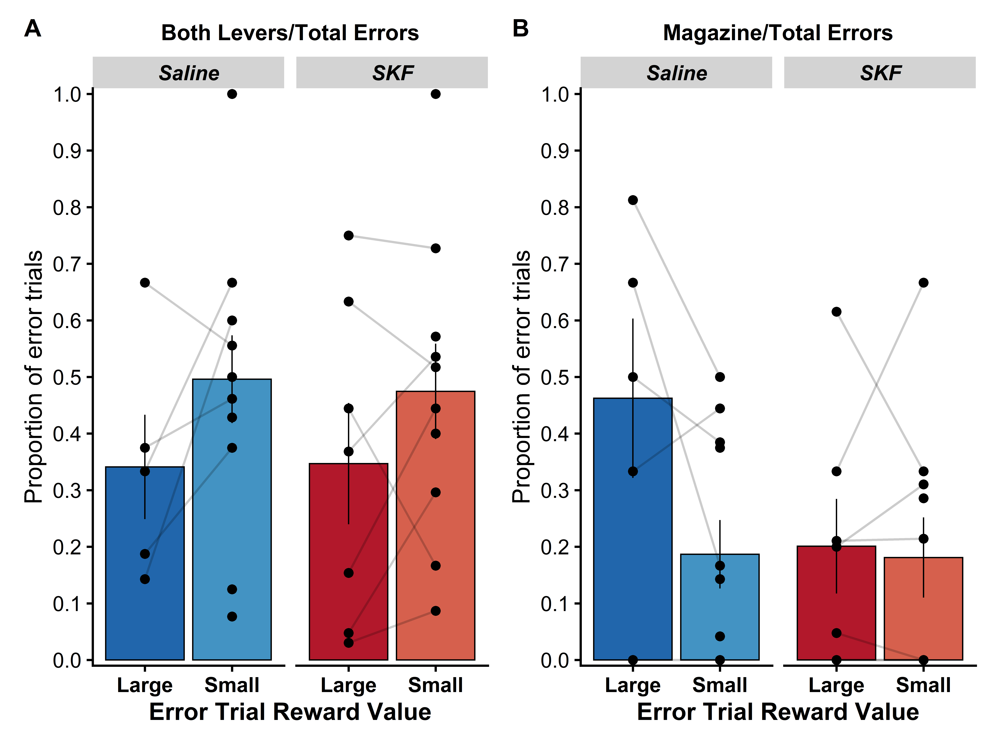
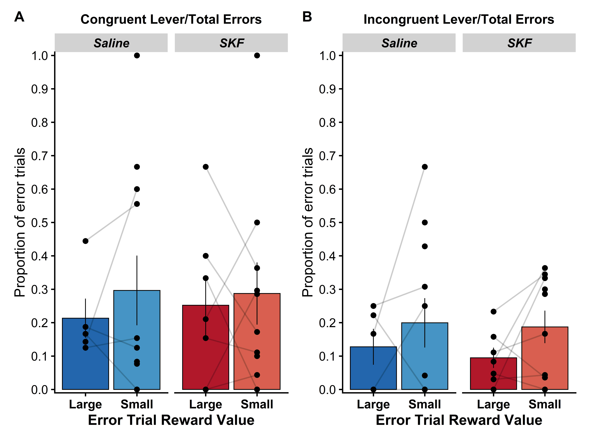

```{r setup, include=FALSE, message = FALSE, warning=FALSE}
knitr::opts_chunk$set(echo = FALSE)
## Packages for data organisation and plotting
library(tidyverse)
# Package for relative file paths
library(here)
# library(ggpubr)
library(cowplot)
library(ggsignif)
library(patchwork)
################################################################################
## Packages for Data analysis
library(afex)
afex_options(emmeans_model = "multivariate")# use multivariate model for all follow-up tests.
library(emmeans)
# install.packages("devtools")
# devtools::install_github("crsh/papaja")
library(papaja)
library(knitr)
# remotes::install_github("noamross/redoc")
# library(redoc)

## Packages for data organisation and plotting
library(tidyverse)
library(knitr)
library(data.table)
library(broom)
# Package for relative file paths
library(here)
# Pretty Plot Stuff
library(ggpubr)
library(cowplot)
library(ggsignif)
library(patchwork)
library(RColorBrewer)

## Packages for Data analysis
library(afex)
afex_options(emmeans_model = "multivariate")# use multivariate model for all follow-up tests.
library(emmeans)

# Packages for markdown 
# install.packages("devtools")
# devtools::install_github("crsh/papaja")
# library(papaja)
# library(knitr)
# remotes::install_github("noamross/redoc")
# library(redoc)

# Packages for parallel computing significantly speeds things up (sometimes)
library(foreach)
library(doParallel)

numCores = 16
registerDoParallel(numCores)


###Get packages needed for GLMM
###install.packages("lme4")
library(lme4)
###install.packages("car")
library(car)
###install.packages("multcomp")
library(multcomp)
###install.packages("emmeans")
library(emmeans)
###install.packages("ggResidpanel")
library(ggResidpanel)

# Optimisers for GLMM fitting
library(optimx)
library(dfoptim)
```


```{r Load data from figures for Stats , include=FALSE, message = FALSE, warning=FALSE}
datafolder <- "rawdata"
filename <- "SKF_errordata_clean.csv"
rawdata <- fread(here(datafolder,filename))
library(parallel)
nc <- detectCores() # number of cores
cl <- makeCluster(rep("localhost", nc)) # make cluster
```


```{r Analysis 2: Probability of both levers , include=FALSE, message = FALSE, warning=FALSE}
# Analysis 2: Probability of both levers ----------------------------------

# Analysis approach - start with maximal random effects model and reduce until fit

model2_bothlevers <- mixed(cbind(BothLevers,not_BothLevers) ~ RewardSize*Drug + (1+RewardSize + Drug|SubjID), 
                           data = rawdata, 
                           family=binomial, 
                           method = "LRT",
                           all_fit = TRUE,
                           cl = cl)


# nice(model2_bothlevers)
emmeans_model2_bothlevers <- emmeans(model2_bothlevers, pairwise~RewardSize*Drug, adjust = "tukey", type = "response")
# emmeans_model2_bothlevers$contrasts


# Analysis 3: Probability of Mag ----------------------------------
model3_Mag <- mixed(cbind(Mag,not_Mag) ~ RewardSize*Drug + ( 1 + RewardSize + Drug|SubjID), 
                           data = rawdata, 
                           family=binomial, 
                           method = "LRT",
                           all_fit = TRUE,
                           cl = cl)


# nice(model3_Mag)
emmeans_model3_Mag <- emmeans(model3_Mag, pairwise~RewardSize*Drug, adjust = "tukey", type = "response")
# emmeans_model3_Mag$contrasts

# Analysis 4: Probability of Large Lever ----------------------------------

model4_Llever <- mixed(cbind(Llever,not_Llever) ~ RewardSize*Drug + ( 1 + RewardSize + Drug|SubjID), 
                    data = rawdata, 
                    family=binomial, 
                    method = "LRT",
                    all_fit = TRUE,
                    cl = cl)


# nice(model4_Llever)
emmeans_model4_Llever <- emmeans(model4_Llever, pairwise~RewardSize*Drug, adjust = "tukey", type = "response")
# emmeans_model4_Llever$contrasts


# Analysis 5: Probability of Small Lever ----------------------------------

model5_Slever <- mixed(cbind(Slever,not_Slever) ~ RewardSize*Drug + ( 1 + RewardSize + Drug|SubjID), 
                       data = rawdata, 
                       family=binomial, 
                       method = "LRT",
                       all_fit = TRUE,
                       cl = cl)


# nice(model5_Slever)
emmeans_model5_Slever <- emmeans(model5_Slever, pairwise~RewardSize*Drug, adjust = "tukey", type = "response")
# emmeans_model5_Slever$contrasts


# Analysis 6: Probability of COngruent Lever ----------------------------------
model6_congruentlever <- mixed(cbind(congruentlever,not_congruentlever) ~ RewardSize*Drug + ( 1 + RewardSize + Drug|SubjID), 
                       data = rawdata, 
                       family=binomial, 
                       method = "LRT",
                       all_fit = TRUE,
                       cl = cl)


# nice(model6_congruentlever)
emmeans_model6_congruentlever <- emmeans(model6_congruentlever, pairwise~RewardSize*Drug, adjust = "tukey", type = "response")
# emmeans_model6_congruentlever$contrasts


# Analysis 6: Probability of Incongruent Lever ----------------------------------
model7_incongruentlever <- mixed(cbind(incongruentlever,not_incongruentlever) ~ RewardSize*Drug + ( 1 + RewardSize + Drug|SubjID), 
                               data = rawdata, 
                               family=binomial, 
                               method = "LRT",
                               all_fit = TRUE,
                               cl = cl)


# nice(model7_incongruentlever)
emmeans_model7_incongruentlever <- emmeans(model7_incongruentlever, pairwise~RewardSize*Drug, adjust = "tukey", type = "response")
# emmeans_model7_incongruentlever$contrasts

```


 

## A) Analysis of both levers data
`r apa_table(model2_bothlevers$anova_table)`

## B) Analysis of magazine data
`r apa_table(model3_Mag$anova_table)`


 


## A) Analysis of large reward lever
`r apa_table(model4_Llever$anova_table)`

## B) Analysis of large reward lever
`r apa_table(model5_Slever$anova_table)`

 


## A) Analysis of congruent reward lever
`r apa_table(model6_congruentlever$anova_table)`

## A) Analysis of incongruent reward lever
`r apa_table(model7_incongruentlever$anova_table)`

