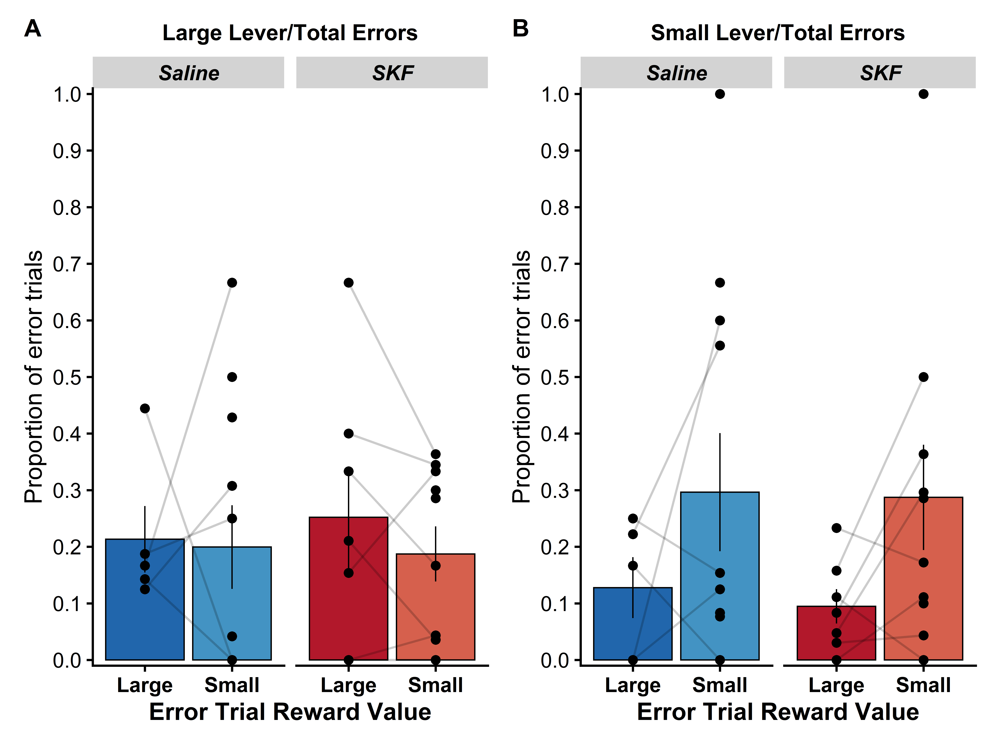

```{r setup, include=FALSE, message = FALSE, warning=FALSE}
knitr::opts_chunk$set(echo = FALSE)
library(tinytex)
## Packages for data organisation and plotting
library(tidyverse)
# Package for relative file paths
library(here)
# library(ggpubr)
library(cowplot)
library(ggsignif)
library(patchwork)
################################################################################
## Packages for Data analysis
library(afex)
afex_options(emmeans_model = "multivariate")# use multivariate model for all follow-up tests.
library(emmeans)
# install.packages("devtools")
# devtools::install_github("crsh/papaja")
library(papaja)
library(knitr)
# remotes::install_github("noamross/redoc")
# library(redoc)

## Packages for data organisation and plotting
library(tidyverse)
library(knitr)
library(data.table)
library(broom)
# Package for relative file paths
library(here)
# Pretty Plot Stuff
library(ggpubr)
library(cowplot)
library(ggsignif)
library(patchwork)
library(RColorBrewer)

## Packages for Data analysis
library(afex)
afex_options(emmeans_model = "multivariate")# use multivariate model for all follow-up tests.
library(emmeans)

# Packages for markdown 
# install.packages("devtools")
# devtools::install_github("crsh/papaja")
# library(papaja)
# library(knitr)
# remotes::install_github("noamross/redoc")
# library(redoc)

# Packages for parallel computing significantly speeds things up (sometimes)
library(foreach)
library(doParallel)

numCores = 16
registerDoParallel(numCores)


###Get packages needed for GLMM
###install.packages("lme4")
library(lme4)
###install.packages("car")
library(car)
###install.packages("multcomp")
library(multcomp)
###install.packages("emmeans")
library(emmeans)
###install.packages("ggResidpanel")
library(ggResidpanel)

# Optimisers for GLMM fitting
library(optimx)
library(dfoptim)
```


```{r Load data from figures for Stats , include=FALSE, message = FALSE, warning=FALSE}
# Load Raw Data
datafolder <- "rawdata"
filename <- "SKF_errordata_clean.csv"
rawdata <- fread(here(datafolder,filename))

# Reanalyze data?
reanalysis = FALSE

if (reanalysis){
  source(here("scripts", "SKF_DataManipulation.R"))
}
# Load Analyses
datafolder <- "rawdata"
filename <- "SKF_errordata_analyses.RData"
load(here(datafolder,filename))


```


 

# A) Analysis of both levers data

### Full random effects
`r apa_table(model2_bothlevers$anova_table)` 

### Only subject random effects
`r apa_table(model_simple_2_bothlevers$anova_table)` 


# B) Analysis of magazine data
### Full random effects
`r apa_table(model3_Mag$anova_table)` 

### Only subject random effects
`r apa_table(model_simple_3_Mag$anova_table)` 

\newpage

 


# A) Analysis of large reward lever
### Full random effects
`r apa_table(model4_Llever$anova_table)`

### Only subject random effects
`r apa_table(model_simple_4_Llever$anova_table)`

# B) Analysis of small reward lever
### Full random effects
`r apa_table(model5_Slever$anova_table)` 

### Only subject random effects
`r apa_table(model_simple_5_Slever$anova_table)` 

\newpage

 


# A) Analysis of congruent reward lever
### Full random effects
`r apa_table(model6_congruentlever$anova_table)`

### Only subject random effects
`r apa_table(model_simple_6_congruentlever$anova_table)`

# A) Analysis of incongruent reward lever
### Full random effects
`r apa_table(model7_incongruentlever$anova_table)`

### Only subject random effects
`r apa_table(model_simple_7_incongruentlever$anova_table)`

